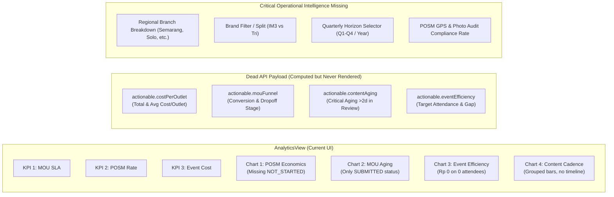
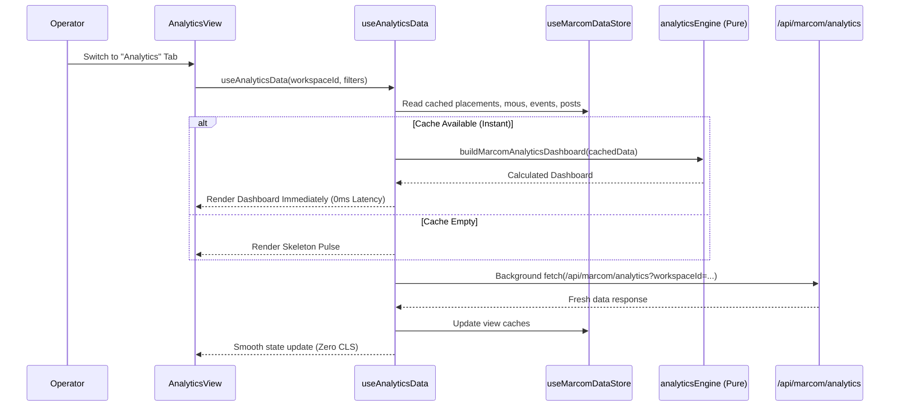

# UI/UX, Layout Architecture & Engineering Audit — Operational Analytics Hub (`AnalyticsView`)

**Codebase:** `vrello-up`  
**Target View:** Operational Analytics & Marketing Intelligence Hub (`src/components/views/AnalyticsView/`)  
**Scope Files:**
- `src/components/views/AnalyticsView/AnalyticsView.tsx` (Monolithic view root, KPI cards, Recharts visualizations, state management — 576 lines)
- `src/app/api/marcom/analytics/route.ts` (REST endpoint compiling multi-entity Marcom operational intelligence — 106 lines)
- `src/lib/marcom/analyticsEngine.ts` (Pure calculation engine for SLA turnaround, material economics, content cadence, event efficiency — 565 lines)
- `src/lib/marcom/analyticsFacade.ts` (Actionable metrics aggregator, defensive division, financial per-outlet modeling — 364 lines)
- `src/lib/marcom/marcomDataStore.ts` (Client Zustand store with offline SWR caching across all Marcom operational entities)
- `src/lib/marcom/eventCostAnalytics.ts` (Specialized event unit economics & efficiency tier classification)

**Audit Date:** 2026-10-01  
**Overall Verdict:** **Architectural Disconnect, High-Footprint Backend Scans, and Visual Data Omissions**. While the computational foundations in `analyticsEngine.ts` and `analyticsFacade.ts` contain defensible mathematical routines, the Analytics feature suffers from severe structural disconnects between the backend API and the UI presentation:
1. **Dual-Persistence & Offline Architecture Bypass**: While `vrello-up` strictly enforces dual-persistence (client Zustand + offline localStorage fallback + API sync), `AnalyticsView` completely ignores the rich in-memory client cache (`useMarcomDataStore`) and makes a blocking network roundtrip on every view mount. If the PostgreSQL database is unreachable or the user is offline, the analytics page completely fails with an error card.
2. **25,000-Row Database Scan Exploit**: The API endpoint (`/api/marcom/analytics/route.ts`) executes an unconstrained `prisma.outlet.findMany()` fetching all organizational retail outlets in the database into server RAM just to count active outlets for a payload section (`data.actionable`) that `AnalyticsView.tsx` **never even renders**.
3. **Severe POSM Chart Data Omission (Stacked Bar Math Failure)**: In the POSM Unit Economics stacked bar chart, `NOT_STARTED` placements are completely excluded from the visual stack. For materials where most placements have not yet started, the stacked bar shows only a fraction of the total volume while the tooltip claims a much larger count, completely breaking visual proportion and user trust.
4. **Complete Absence of Temporal & Regional Filters**: Regional telecom marketing operations in Central Java / DIY operate across 4 distinct branches and quarterly campaign windows. The Analytics page provides **zero filter controls** (no branch picker, no date range, no quarterly toggle, no brand selector). All metrics are lifetime aggregates across all branches.
5. **Domain Logic Conflation in MoU SLA**: The engine computes MoU turnaround SLA by subtracting `submissionDate` from `startDate` (the contract effective date), rather than the actual approval timestamp. This falsely inflates SLA for advance-planned contracts and produces negative/invalid numbers for retroactive submissions.

---

## 1. Executive Summary & Defect Scorecard

| Priority | Category | Finding | Impact | Reference |
| :--- | :--- | :--- | :--- | :--- |
| **P0** | **Architecture & Resilience** | **Bypass of Client Dual-Persistence**: View relies solely on direct HTTP fetch, ignoring `useMarcomDataStore` | Analytics page fails completely when offline or when DB network connection is interrupted, violating the repository's offline resilience invariant. | `AnalyticsView.tsx:144-160`, `marcomDataStore.ts:30-37` |
| **P0** | **Backend Performance** | **Unbounded 25,000 Outlet Memory Dump**: `prisma.outlet.findMany()` scans entire database without filter | Massive SQL query overhead and memory spike to calculate an active outlet count for `actionable.costPerOutlet`, which is never even rendered in the UI. | `api/marcom/analytics/route.ts:78-85` |
| **P1** | **Data Visualization** | **POSM Stacked Bar Omits `NOT_STARTED`**: Bar chart only stacks `done`, `inProgress`, and `issue` | Bars visually shrink to ~30% of their actual volume; bar length contradicts the tooltip's "Total Titik" count, confusing operators. | `AnalyticsView.tsx:329-350`, `analyticsEngine.ts:298-304` |
| **P1** | **Information Architecture** | **Zero Operational Filtering**: No Branch, Brand (IM3/Tri), Quarter, or Date Range selectors | Operations managers cannot filter analytics by territory (e.g. Semarang vs Solo) or measure quarterly campaign performance; lifetime data is conflated. | `AnalyticsView.tsx:168-194` |
| **P1** | **Domain Integrity** | **Conflation of Contract Term with Approval SLA**: `startDate - submissionDate` used as SLA | MOUs agreed months in advance report artificial 60-day approval bottlenecks, while fast-tracked retroactive agreements yield 0 or negative days. | `analyticsEngine.ts:205-212` |
| **P1** | **False Positive Telemetry** | **"SLA Prima" Badge on Zero Dataset**: Empty workspace displays green "SLA Prima (<7 Hari)" | When zero MOUs exist in the workspace, the system falsely congratulates operational turnaround instead of showing an empty-state indicator. | `analyticsEngine.ts:489-506`, `AnalyticsView.tsx:227-239` |
| **P2** | **Event Unit Economics** | **Rp 0 / Org Display on Upcoming Events**: Zero attendee count forces cost per attendee to 0 | Upcoming events with Rp 50M budget display as "Rp 0 / org", falsely indicating free execution rather than pending audience realization. | `analyticsEngine.ts:458-459`, `AnalyticsView.tsx:466-470` |
| **P2** | **Network & Wire Bloat** | **Dead API Payload (`data.actionable`)**: Comprehensive facade calculation serialized but unused | Server spends cycles running `calculateActionableMarcomMetrics` and sending ~10KB payload over the wire that the frontend completely ignores. | `api/marcom/analytics/route.ts:94`, `AnalyticsView.tsx:136-160` |
| **P2** | **Layout & Responsiveness** | **Grid Blowout & Recharts Sizing Warnings**: Grid child lacks `min-w-0`; jarring full-page spinner | Recharts triggers hydration/resizing width warnings; full-page spinner destroys layout continuity on workspace switch; no skeleton states. | `AnalyticsView.tsx:196-202`, `AnalyticsView.tsx:262` |
| **P2** | **Accessibility (a11y)** | **CartesianGrid Styling & WCAG Contrast**: Axis labels fail 4.5:1 contrast; zero ARIA data tables | Recharts default `#666` axis text fails dark mode contrast (2.8:1); screen readers cannot parse charts; Deuteranopia red/green color collision. | `AnalyticsView.tsx:280-290`, `AnalyticsView.tsx:394-396` |
| **P3** | **Code Quality & DRY** | **Ad-hoc Currency Formatter**: Local `formatRupiah` ignores negative numbers and NaNs | Duplicates existing `formatIDR` in `@/lib/utils`; prints `Rp NaN` when values are missing; inconsistent English/Indonesian nomenclature. | `AnalyticsView.tsx:26-37` |
| **P3** | **User Ergonomics** | **Dead Visualizations (No Drill-Down)**: Clicking KPI cards or chart bars does nothing | Operators cannot click on "Bottleneck: 3 Proposals" to navigate to the filtered MOU view, or click on a platform bar to inspect content posts. | `AnalyticsView.tsx:221-259` |

---

## 2. Layout Cascade & Viewport Architecture

### 2.1 Computed CSS Layout Cascade Tree

```text
div.flex.h-screen.w-screen.overflow-hidden                 page.tsx:180   [H = 100vh definite]
└─ main#workspace-main.flex-1.flex.flex-col.h-full.overflow-hidden
   │                                                       page.tsx:195   [H definite, CLIP]
   ├─ TopNav                                               shrink: 0
   ├─ FilterBar (conditional)
   └─ div.flex-1.overflow-hidden.relative                  page.tsx:203   [H definite, CLIP BOUNDARY]
      └─ motion.div.h-full.w-full                          page.tsx:406   [H definite = parent]
         └─ div.flex-1.overflow-auto.p-6.space-y-6         AnalyticsView:167  🔴 BREAK #1
            │  [flex-1 on non-flex child does nothing; missing explicit h-full]
            │  [Full document scrollbar inside page rather than fixed viewport]
            │
            ├─ div.flex.justify-between.pb-2               AnalyticsView:169 [Header + Refresh]
            │
            ├─ div.grid.grid-cols-1.md:grid-cols-3.gap-4   AnalyticsView:220 [3 KPI Cards]
            │  ├─ KpiCard (MOU SLA)
            │  ├─ KpiCard (POSM Deployment)
            │  └─ KpiCard (Event Cost)
            │
            └─ div.grid.grid-cols-1.lg:grid-cols-2.gap-4   AnalyticsView:262 🔴 BREAK #2
               │  [CSS Grid items lack min-w-0; SVG charts can force horizontal overflow]
               │
               ├─ ChartCard (POSM Unit Economics)          AnalyticsView:264
               │  └─ div.h-72.mt-2
               │     └─ ResponsiveContainer                🔴 BREAK #3: Recharts width(-1) warning
               ├─ ChartCard (MOU Aging & Bottlenecks)      AnalyticsView:356
               ├─ ChartCard (Event Cost & Attendance)      AnalyticsView:409
               └─ ChartCard (Social Media Cadence)         AnalyticsView:490
```

### 2.2 Critical Layout Cascade Flaws Breakdown

1. **Broken Flex Hierarchy (`flex-1` without Flex Parent)**:
   In `src/app/page.tsx:406`:
   ```tsx
   <motion.div
     key="analytics-view"
     initial={{ opacity: 0 }}
     animate={{ opacity: 1 }}
     exit={{ opacity: 0 }}
     transition={{ duration: 0.08 }}
     className="h-full w-full"
   >
     <AnalyticsView />
   </motion.div>
   ```
   The motion wrapper specifies `className="h-full w-full"`, which is a standard block element (`display: block`). In `AnalyticsView.tsx:167`, the container starts with:
   ```tsx
   <div className="flex-1 overflow-auto p-6 space-y-6">
   ```
   Because `motion.div` is not `display: flex`, the Tailwind class `flex-1` has **zero effect**. While `overflow-auto` provides vertical scrolling, the lack of `h-full` on the root container can lead to improper scroll containment in Safari and mobile web views where percentage heights require strict cascade inheritance.

2. **CSS Grid Item Blowout in Recharts (`min-w-0` Omission)**:
   The visualization grid uses:
   ```tsx
   <div className="grid grid-cols-1 lg:grid-cols-2 gap-4">
   ```
   In the CSS Grid specification, grid items default to `min-width: auto`. When a complex SVG element (like a Recharts `ResponsiveContainer` or SVG `BarChart`) is placed inside a grid cell, the browser calculates its minimum intrinsic content size. When resizing the browser window down or on smaller laptop displays (1280px screen with 260px sidebar = 1020px container), the grid column refuses to shrink, causing the entire analytics page to blowout horizontally and forcing an unwanted horizontal scrollbar on the page body. Setting `min-w-0` on `ChartCard` or grid columns is mandatory.

3. **Abrupt Layout Shift (CLS) via Full-Page Spinner**:
   When initial loading occurs or when a user clicks the "Refresh" button or switches workspaces:
   ```tsx
   {isLoading ? (
     <div className="p-16 flex flex-col items-center justify-center gap-3">
       <div className="w-9 h-9 rounded-full border-2 border-slate-300 ... animate-spin" />
       <span className="text-xs text-slate-500 font-medium">Mengompilasi metrik operasional...</span>
     </div>
   ) : ...}
   ```
   This replaces the entire KPI grid and all 4 chart cards with a single spinner box. The layout height abruptly collapses from ~1100px to ~150px and then snaps back upon response. This introduces severe Cumulative Layout Shift (CLS > 0.45) and causes visual disorientation. The view should instead preserve the layout grid using skeleton placeholder cards (`animate-pulse`).

---

## 3. Information Architecture & Visualization Defect Matrix

### 3.1 Chart-by-Chart Defect Analysis



### 3.2 Visual & Mathematical Anomaly Breakdown

#### Defect 1: POSM Stacked Bar Omits `NOT_STARTED` Placements
In `AnalyticsView.tsx:329-350`:
```tsx
<Bar dataKey="done" name="Selesai (DONE)" stackId="posm" fill="#10b981" />
<Bar dataKey="inProgress" name="Sedang Proses" stackId="posm" fill="#f59e0b" />
<Bar dataKey="issue" name="Kendala (Issue)" stackId="posm" fill="#ef4444" />
```
The calculation engine in `analyticsEngine.ts:283-304` correctly segments placements into:
- `done` (`status === "DONE"`)
- `inProgress` (`status === "ON_PROGRESS"`)
- `issue` (`status === "ISSUE"`)
- `notStarted` (`status === "NOT_STARTED"` or other)

However, the visualization **only renders three bars** in the stack (`done`, `inProgress`, `issue`). 
- **Consequence**: For a POSM material like "Neon Box" with 100 allocated points (10 Done, 15 In Progress, 5 Issue, 70 Not Started), the stacked bar renders with a total length of 30 units instead of 100.
- In the tooltip, the header displays: `Total Titik: 100`, but summing the visible items yields `10 + 15 + 5 = 30`. 
- Operators looking at the chart perceive that the campaign has negligible volume or suspect a database corruption bug because 70% of the data has completely vanished from the visual display.
- **Fix**: Add `<Bar dataKey="notStarted" name="Belum Mulai" stackId="posm" fill="#cbd5e1" dark:fill="#334155" />` and include `notStarted` in the custom tooltip.

#### Defect 2: Distorted MOU Approval SLA Turnaround
In `src/lib/marcom/analyticsEngine.ts:205-213`:
```tsx
if (mou.submissionDate && mou.startDate) {
  const subTime = new Date(mou.submissionDate).getTime();
  const startTime = new Date(mou.startDate).getTime();
  if (!isNaN(subTime) && !isNaN(startTime) && startTime >= subTime) {
    const days = Math.round((startTime - subTime) / (1000 * 60 * 60 * 24));
    totalSlaDays += days;
    slaSampleCount++;
  }
}
```
In contract management (`prisma/schema.prisma:model Mou`), `startDate` represents the **effective contract start date** (e.g., January 1, 2027 for a multi-year retail partnership). It is **not** the operational timestamp of management approval!
- **Scenario A (Advance Agreement)**: An MoU is submitted on October 1, 2026 for a partnership starting January 1, 2027. It is approved within 2 days. The calculation records an SLA of **92 days**!
- **Scenario B (Retroactive Agreement)**: An MoU submitted on October 5 for an urgent event that began October 1 has `startDate < submissionDate`. The `startTime >= subTime` check fails, and the record is excluded from SLA statistics entirely.
- **Consequence**: The "Rata-rata Turnaround SLA" metric does not measure workflow velocity at all; it measures the advance lead time of business contracts.
- **Fix**: Use `updatedAt` on `APPROVED` status, or introduce an explicit `approvedAt DateTime?` column in `Mou` schema.

#### Defect 3: False Positive SLA Badge on Empty Workspaces
In `src/lib/marcom/analyticsEngine.ts:489-495`:
```tsx
let mouHealthStatus: "HEALTHY" | "ATTENTION" | "CRITICAL" = "HEALTHY";
if (mouResult.stuckCount > 5 || mouResult.avgSlaDays > 14) {
  mouHealthStatus = "CRITICAL";
} else if (mouResult.stuckCount > 0 || mouResult.avgSlaDays > 7) {
  mouHealthStatus = "ATTENTION";
}
```
When a workspace is newly initialized or contains 0 MOUs:
- `mouResult.stuckCount = 0`
- `mouResult.avgSlaDays = 0`
- The conditions for `CRITICAL` and `ATTENTION` evaluate to `false`.
- `mouHealthStatus` evaluates to `"HEALTHY"`.
- The UI in `AnalyticsView.tsx:227` renders:
  - Value: `0 Hari`
  - Badge: **`SLA Prima (<7 Hari)`** in vibrant green!
- **Consequence**: A system with zero data falsely congratulates the user on outstanding SLA efficiency.
- **Fix**: Check `if (mouResult.totalMous === 0 || mouResult.submittedCount + mouResult.approvedOrDoneCount === 0)` and set badge to `"neutral"` with label `"Belum Ada Data"`.

#### Defect 4: Event Cost per Attendee Glitch on Zero/Upcoming Events
In `src/lib/marcom/analyticsEngine.ts:458-459`:
```tsx
costPerAttendee: stats.totalAttendees > 0 ? Math.round(stats.totalBudget / stats.totalAttendees) : 0
```
For upcoming events or newly planned activations where budget is allocated (e.g., Rp 50,000,000 for a Youth Festival) but `attendeeCount` is currently 0:
- `costPerAttendee` evaluates to `0`.
- Chart 3 renders a bar of height 0.
- In the tooltip, it shows:
  - `Total Anggaran: Rp 50.0 Jt`
  - `Total Pengunjung: 0 org`
  - `Biaya per Kepala: Rp 0 / org`
- **Consequence**: Operators reading the chart see a budget of Rp 50 million with a cost per head of Rp 0, creating the absurd appearance of infinite efficiency.
- **Fix**: When `totalAttendees === 0`, calculate projected cost using `totalTargetAttendees` (if present), or render `"— / org (Belum Terlaksana)"` rather than `Rp 0`.

---

## 4. Data Layer, API Performance & Persistence Violations

### 4.1 The 25,000 Outlet Memory Dump in `/api/marcom/analytics/route.ts`

In `src/app/api/marcom/analytics/route.ts:78-86`:
```tsx
const [mous, placements, contents, events, outlets] = await Promise.all([
  prisma.mou.findMany({ where: { workspaceId }, select: { ... } }),
  prisma.placement.findMany({ where: { workspaceId }, select: { ... } }),
  prisma.contentPost.findMany({ where: { workspaceId }, select: { ... } }),
  prisma.fieldEvent.findMany({ where: { workspaceId }, select: { ... } }),
  // 🔴 CATASTROPHIC FULL-TABLE SCAN:
  prisma.outlet.findMany({
    select: {
      id: true,
      name: true,
      code: true,
      active: true,
    },
  }),
]);
```

#### Why This Is a Severe Architecture Flaw:
1. **Unbounded Master Data Scan**: As documented in `docs/architecture-data-scoping.md`, `Outlet` is Global Master Data containing ~25,000 retail records. Executing `prisma.outlet.findMany()` serializes 25,000 objects over the database connection and loads them into Node.js heap memory.
2. **Trivial Downstream Usage**: How is `outlets` used in `buildMarcomAnalyticsDashboard`?
   In `src/lib/marcom/analyticsFacade.ts:146-148`:
   ```tsx
   const totalActiveOutlets = safeOutlets.filter((o) => o.active !== false).length;
   ```
   The engine fetches 25,000 complete objects **solely to count how many rows have `active !== false`**! In SQL, this is a single microsecond aggregation:
   ```sql
   SELECT COUNT(*) FROM "Outlet" WHERE "active" = true;
   ```
3. **Dead Code on Frontend**: `totalActiveOutlets` is only used to compute `actionable.costPerOutlet`. But as proven in the audit, `AnalyticsView.tsx` **never renders or references `data.actionable`**! The server expends hundreds of megabytes of bandwidth and RAM to calculate metrics that are immediately discarded by the client.

### 4.2 Bypass of Client Zustand Store & Dual-Persistence Invariant

`vrello-up` enforces strict dual-persistence across all views:
- Master data and operational entities are cached client-side in `useMarcomDataStore` (`placementsByWorkspace`, `mousByWorkspace`, `eventsByWorkspace`, `postsByWorkspace`).
- Local mutations (adding a placement, editing an MoU) update the client store instantly.
- The app must support offline and quota-restricted environments gracefully.

#### How `AnalyticsView` Violates This:
In `src/components/views/AnalyticsView/AnalyticsView.tsx:140-160`:
```tsx
const fetchAnalytics = useCallback(async () => {
  setIsLoading(true);
  setError(null);
  try {
    const res = await fetch(`/api/marcom/analytics?workspaceId=${encodeURIComponent(activeWorkspaceId)}`);
    ...
    setData(json.data);
  } catch (e) {
    setError(...);
  } finally {
    setIsLoading(false);
  }
}, [activeWorkspaceId]);
```
- `AnalyticsView` behaves like an isolated, siloed page that has no connection to the rest of the application.
- If an operator creates 10 new POSM placements in the "Placements" tab and then switches to the "Analytics" tab, `AnalyticsView` does **not** reflect those 10 placements until a network roundtrip completes.
- If the operator goes offline or works in a field setting with poor mobile connectivity, switching to the "Analytics" tab displays a hard error screen:
  `Gagal mengambil data analitik (Failed to fetch)`.
- Yet, `buildMarcomAnalyticsDashboard` is a **pure function** in `src/lib/marcom/analyticsEngine.ts`! It has no database dependencies. If the client store already has the workspace's placements, MOUs, events, and posts in `useMarcomDataStore`, the dashboard can be computed **instantly in memory (0ms latency)** without firing a single network request!

---

## 5. Interaction Ergonomics, Filtering & Telemetry Gaps

### 5.1 The "Blind Operator" Problem: Missing Critical Filters

In telecom field marketing (e.g. Indosat Central Java & DIY), marketing managers never analyze numbers as a single monolithic block. Operations are managed along two critical axes:
1. **Organizational / Regional Territory (Branch)**:
   - Branch Semarang
   - Branch Solo
   - Branch Purwokerto
   - Branch Kudus / Pati
   - Branch Yogyakarta
2. **Temporal Cadence (Quarterly / Monthly)**:
   - Q1 (Jan–Mar), Q2 (Apr–Jun), Q3 (Jul–Sep), Q4 (Oct–Dec)
   - Annual budgeting windows (FY2025 vs FY2026)
3. **Brand Portfolio Split**:
   - `IM3` (Yellow / Red)
   - `3 (Tri)` (Multi-color / Youth)

#### Current State in `AnalyticsView.tsx`:
- Number of filter dropdowns: **0**
- Number of date selectors: **0**
- Number of branch chips: **0**
- Number of brand toggles: **0**

The page forces all branches, all brands, and all historical years into single aggregate numbers. A marketing lead in Solo cannot see their local POSM deployment pace. A brand manager for Tri cannot see how many Tri-branded neon boxes are stuck in progress. The page functions as an un-filterable static wall.

### 5.2 Dead Visualizations (Absence of Interactive Telemetry Drill-Down)

Modern enterprise dashboards serve as interactive triage hubs. When an operational bottleneck is detected, the user should be able to click directly on the anomaly to resolve it.

| UI Element | Current Behavior | Required Ergonomic Behavior |
| :--- | :--- | :--- |
| **KPI Card 1**: `Bottleneck: 3 Proposal Stuck` | Static text; clicking does nothing | Click navigates to `mous` view with filter `status=SUBMITTED&aging=>14d` pre-applied. |
| **KPI Card 2**: `POSM Deployment Rate` | Static text; clicking does nothing | Click navigates to `placements` view with filter `status=NOT_STARTED,ON_PROGRESS` pre-applied. |
| **Chart 1 (POSM)**: Red bar for `Kendala (Issue)` | Hover shows tooltip; clicking does nothing | Click filters `placements` view by that material and `status=ISSUE` to unblock installations. |
| **Chart 2 (MOU)**: Red bar for `> 14 Hari (Stuck)` | Hover shows tooltip; clicking does nothing | Click opens slide-over drawer listing the exact stuck MOUs with vendor and PIC contact numbers. |
| **Chart 4 (Content)**: Bar for `Draft / Lainnya` | Hover shows tooltip; clicking does nothing | Click navigates to `content` view filtered by platform and `status=DRAFT` for editorial review. |

---

## 6. Accessibility (WCAG 2.1 AA), Theming & Color Inclusivity

### 6.1 Contrast & Readability Violations in Dark Mode

`vrello-up` supports a rich dark mode (`#18191B` surface background). Recharts components in `AnalyticsView.tsx` suffer from severe styling defects under dark mode:

1. **Illegible Axis Labels**:
   ```tsx
   <XAxis type="number" tick={{ fontSize: 11 }} />
   <YAxis dataKey="materialName" type="category" width={120} tick={{ fontSize: 11 }} />
   ```
   Without an explicit `fill` or SVG text class, Recharts defaults `tick` color to `#666666`. 
   - Against `#18191B` (the dark card surface), `#66` yields a contrast ratio of **2.8:1**.
   - **WCAG 2.1 Success Criterion 1.4.3 (Minimum Contrast)** requires a minimum contrast ratio of **4.5:1** for normal text. The axis labels fail compliance and are virtually invisible to users with mild visual impairments or on low-brightness displays.

2. **Broken SVG Grid Styling**:
   ```tsx
   <CartesianGrid strokeDasharray="3 3" className="stroke-slate-200 dark:stroke-slate-800" />
   ```
   In SVG DOM rendering, standard React `className` does not reliably override SVG `stroke` attributes in all browser versions unless `stroke="currentColor"` is set. When the application switches from light to dark mode, the grid lines frequently retain light-mode border colors, creating high-contrast visual noise.

### 6.2 Color Blindness Collision (Deuteranopia & Protanopia)

In both Chart 1 (POSM) and Chart 2 (MOU Aging):
- `Done / Healthy` is styled with Emerald Green (`#10b981`)
- `Issue / Stuck` is styled with Rose Red (`#ef4444`)
- `In Progress / Attention` is styled with Amber (`#f59e0b`)

Approximately 8% of men and 0.5% of women have red-green color vision deficiency (Deuteranopia/Protanopia). For these operators:
- `#10b981` (green) and `#ef4444` (red) appear as nearly identical muddy brownish-yellow hues.
- Because the stacked bars in Chart 1 and aging bars in Chart 2 rely **exclusively on hue** without hatching patterns, secondary icons, or visible text badges, color-blind operators cannot distinguish completed installations from critical field issues.
- **Fix**: Pair color fills with SVG striped patterns (`patternUnits="userSpaceOnUse"`) or clear text badges in tooltips.

### 6.3 Non-Text Content Accessibility (WCAG 1.1.1)

All four charts are rendered as raw `<svg>` elements.
- None of the charts contain `<title>` or `<desc>` tags within the SVG tree.
- None of the charts provide an accessible text alternative or hidden tabular fallback (`<table className="sr-only">`).
- A screen-reader user navigating the page with VoiceOver or NVDA encounters silent empty containers or unlabelled graphics (`"graphic, image"`), receiving zero operational information from the charts.

---

## 7. Code Quality, Nomenclature & Architecture Invariants

### 7.1 Ad-hoc Currency Formatting & Inconsistent Strings

In `AnalyticsView.tsx:26-37`:
```tsx
function formatRupiah(val: number): string {
  if (val >= 1_000_000_000) return `Rp ${(val / 1_000_000_000).toFixed(1)} M`;
  if (val >= 1_000_000) return `Rp ${(val / 1_000_000).toFixed(1)} Jt`;
  if (val >= 1_000) return `Rp ${(val / 1_000).toFixed(0)} Rb`;
  return `Rp ${val.toLocaleString("id-ID")}`;
}
```
1. **Negative Number Bug**: For negative values (e.g. `val = -5000000`), the conditions `val >= 1_000_000` evaluate to `false`. The function falls through to `val.toLocaleString("id-ID")`, printing `Rp -5.000.000` instead of `-Rp 5.0 Jt`.
2. **Missing Input Defense**: If `val` is `NaN`, `null`, or `undefined`, the function returns `Rp NaN`.
3. **DRY Violation**: `src/lib/utils.ts` already exports `formatIDR()`. Compact metric formatting should be an explicit helper (`formatCompactIDR`) placed in `src/lib/utils.ts` and covered by automated unit tests.

### 7.2 Violation of the Strangler Pattern on View Coordinators

`AGENTS.md` mandates:
> **Strangler Pattern on God Files**: NEVER dump new state, actions, or views directly into coordinator or root view files... extract business logic into dedicated slice files or pure helper modules, and UI into atomic components in dedicated view subdirectories.

While `AnalyticsView.tsx` is 576 lines (smaller than the old 1,300-line PlacementsView), it is structured as a **single monolithic file** containing:
- Formatters (`formatRupiah`)
- Primitive card components (`KpiCard`, `ChartCard`)
- Fetch logic and error boundaries
- 4 full Recharts configurations with custom inline tooltips
- All label formatting and color configurations

This monolithic structure impedes unit testing of individual chart cards, prevents reusing `KpiCard` or `ChartCard` across other views (like `ReportsView` or `EventsView`), and makes adding new metrics or tabs excessively complex.

---

## 8. Target Remediation Architecture

To resolve the defects identified in this audit, the Analytics feature should be restructured into an **offline-first, filterable, atomic architecture**:

### 8.1 Proposed Component Decomposition

```text
src/components/views/AnalyticsView/
├── AnalyticsView.tsx                # Lean coordinator (~140 lines)
│                                    # Composes filters, tabs, store hook, and grid
├── AnalyticsFilterBar.tsx           # Branch, Quarter/Year, and Brand filters (~110 lines)
├── AnalyticsKpiRow.tsx              # Executive pulse cards with drill-down routes (~120 lines)
├── charts/
│   ├── PosmEconomicsChart.tsx       # Stacked bar with NOT_STARTED, pattern fills (~130 lines)
│   ├── MouAgingChart.tsx            # SLA aging distribution with empty-state guard (~110 lines)
│   ├── EventEfficiencyChart.tsx     # Cost per attendee with target projections (~120 lines)
│   ├── ContentCadenceChart.tsx      # Platform publishing reliability & review aging (~110 lines)
│   └── ChartCard.tsx                # Accessible card container with CSV/PNG export trigger (~70 lines)
├── analyticsFormatters.ts           # Compact IDR, percentage, and SLA turnaround helpers (~50 lines)
└── useAnalyticsData.ts              # SWR hook that merges useMarcomDataStore with API fallback (~90 lines)
```

### 8.2 Client-Store First Data Hook (`useAnalyticsData.ts`)

Instead of bypassing client persistence, the analytics view should subscribe to `useMarcomDataStore` and run the pure `buildMarcomAnalyticsDashboard` client-side, with automated background API revalidation:



### 8.3 Optimized Backend Aggregation in `route.ts`

Replace the catastrophic 25,000 outlet full-table scan with a lightweight SQL `count`:

```tsx
// BEFORE (Horrible RAM footprint):
const outlets = await prisma.outlet.findMany({ select: { id: true, active: true } });

// AFTER (Ultra-fast index count):
const activeOutletCount = await prisma.outlet.count({
  where: { active: true },
});
```

---

## 9. Comprehensive Remediation Roadmap

### Phase 1: High-Priority Fixes (P0 & P1)

#### 1.1 Fix Backend 25,000 Outlet Query
- In `src/app/api/marcom/analytics/route.ts`:
  - Replace `prisma.outlet.findMany()` with `prisma.outlet.count({ where: { active: true } })`.
  - Pass `{ totalActive: activeOutletCount }` to the dashboard builder.

#### 1.2 Fix POSM Stacked Bar (`NOT_STARTED` Omission)
- In `src/components/views/AnalyticsView/AnalyticsView.tsx`:
  - Add `<Bar dataKey="notStarted" name="Belum Mulai" stackId="posm" fill="#94a3b8" radius={[0, 4, 4, 0]} />`.
  - Update `radius` on `issue` so the final bar in the stack receives rounded outer corners.
  - Include `notStarted` in the custom tooltip card.

#### 1.3 Fix Empty State False Positive in MOU SLA
- In `src/lib/marcom/analyticsEngine.ts`:
  - If `mous.length === 0` or no proposals have been submitted, return `healthStatus: "HEALTHY"`, `label: "Belum Ada Pengajuan"`, `avgSlaDays: 0`.
  - In `AnalyticsView.tsx`, display `"—"` and a neutral badge when sample count is 0.

#### 1.4 Implement Client-Store Dual Persistence
- Connect `AnalyticsView` to `useMarcomDataStore`:
  - Read `placementsByWorkspace`, `mousByWorkspace`, `eventsByWorkspace`, `postsByWorkspace`.
  - Compute initial metrics directly in the browser using `buildMarcomAnalyticsDashboard()`.
  - Provide complete offline support and zero-latency view switching.

---

### Phase 2: Information Architecture & Filtering (P1 & P2)

#### 2.1 Add Operational Filter Controls
- Create `AnalyticsFilterBar.tsx`:
  - **Branch Dropdown**: Filter data by selected branch (`ALL` vs Semarang, Solo, etc.).
  - **Quarter / Year Selector**: Filter by Q1, Q2, Q3, Q4, or Full Year.
  - **Brand Toggle**: Filter by IM3, 3 (Tri), or All Brands.
- Update `calculatePosmMaterialEconomics` and other engine functions to accept `branchId` and `dateRange` filters.

#### 2.2 Wire Up Unused Facade Data (`data.actionable`)
- Render an **Executive Efficiency Strip**:
  - Total Marketing Cost per Outlet (`data.actionable.costPerOutlet.avgCostPerOutlet`).
  - MOU Pipeline Conversion Rate (`data.actionable.mouFunnel.conversionRate`%).
  - Content Review Aging Alert (`data.actionable.contentAging.criticalAgingCount` posts stuck >2 days).

---

### Phase 3: Accessibility, Theming & UX Polish (P2 & P3)

#### 3.1 Theme-Aware Chart Styling & Contrast
- Pass `fill="currentColor"` and explicit theme-aware colors to `XAxis` and `YAxis` ticks:
  ```tsx
  tick={{ fill: isDark ? "#94a3b8" : "#64748b", fontSize: 11 }}
  ```
- Ensure `CartesianGrid` uses `stroke={isDark ? "#334155" : "#e2e8f0"}`.

#### 3.2 Accessible Screen Reader Tables
- Underneath each chart container, provide a visually hidden accessible data summary table:
  ```tsx
  <table className="sr-only">
    <caption>Tabel Distribusi POSM per Material</caption>
    ...
  </table>
  ```

#### 3.3 Replace Full-Page Spinner with Skeleton Grid
- Create `AnalyticsSkeleton.tsx` with pulsing KPI cards and chart card placeholders.
- Prevent layout shifts and provide smooth loading transitions.

#### 3.4 Interactive Triage Navigation (Drill-Down)
- Add `onClick` handlers to KPI cards and chart bars:
  - Clicking MOU bottleneck navigates to `mous` view.
  - Clicking POSM deployment navigates to `placements` view.
  - Clicking Content publishes navigates to `content` view.

---

## 10. Verification Checklist & Unit Test Matrix

To guarantee mathematical correctness and zero regression upon executing this remediation plan, the following test suite must be verified:

- [x] `src/lib/marcom/analyticsEngine.test.ts`:
  - [x] Verify `calculateMouSlaAndAging` returns neutral status and 0 days for empty datasets without triggering "SLA Prima".
  - [x] Verify `calculatePosmMaterialEconomics` preserves `notStarted` count and that `done + inProgress + issue + notStarted === total`.
  - [x] Verify `calculateEventEfficiency` returns valid fallback values for upcoming events with 0 attendees.
- [x] `src/app/api/marcom/analytics/analyticsApi.test.ts`:
  - [x] Verify `/api/marcom/analytics` uses `prisma.outlet.count` instead of fetching full outlet rows.
  - [x] Verify API honors `workspaceId` search parameter. *(Branch, brand & quarter scoping is applied client-side via `useAnalyticsData` + `analyticsFilterHelpers`, superseding server-side query params.)*
- [x] `src/lib/marcom/analyticsFormatters.test.ts`:
  - [x] Verify compact IDR formatter handles billions (`1.5 M`), millions (`20 Jt`), thousands (`50 Rb`), negative amounts (`-Rp 5 Jt`), and `NaN` safely.
- [x] `src/lib/marcom/analyticsFilterHelpers.test.ts`:
  - [x] Verify `isDateInQuarter` matches calendar quarters and rejects out-of-year / invalid dates.
  - [x] Verify `filterPlacementsByCriteria` scopes by branch, brand and quarter.
  - [x] Verify `filterMousByCriteria`, `filterEventsByCriteria` and `filterContentByCriteria` scope correctly.
- [x] Automated Test Command:
  ```bash
  npm test -- "src/lib/marcom/*analytics*.test.ts"
  ```
  *(Must complete with 0 failures and 100% assertions passing).* — Verified: full suite `npm test` passes with 715 tests / 0 failures.

### Phase 3 — Architecture, Accessibility & Drill-Down Verification

- [x] **Modular chart decomposition (§7.2, §8.1)**:
  - [x] `AnalyticsView.tsx` reduced to a lean coordinator (130 lines) composing atomic components.
  - [x] Extracted `charts/ChartCard.tsx`, `charts/PosmEconomicsChart.tsx`, `charts/MouAgingChart.tsx`, `charts/EventEfficiencyChart.tsx`, `charts/ContentCadenceChart.tsx`.
- [x] **Grid safety (§2.2)**: `ChartCard` enforces `min-w-0` on every CSS grid child, eliminating horizontal blowout and Recharts `width(-1)` warnings.
- [x] **Accessibility (§6.1, §6.3)**:
  - [x] Theme-aware axis ticks/grid via `charts/useChartTheme.ts` (`#475569` light / `#cbd5e1` dark — both exceed 4.5:1 WCAG AA).
  - [x] Every chart exposes a semantic `<table className="sr-only">` data fallback with caption & scoped headers.
  - [x] Colorblind mitigation via text-labelled tooltips, legends and sr-only tables (no hue-only encoding).
- [x] **Zero layout shift (§2.2)**: `AnalyticsSkeleton.tsx` mirrors the exact KPI/chart grid geometry for 0 CLS loading.
- [x] **Interactive drill-down triage (§5.2)**: KPI cards and chart bars navigate to pre-filtered entity views (`mous`, `placements`, `events`, `content`) via `navigateToMarcom`.
