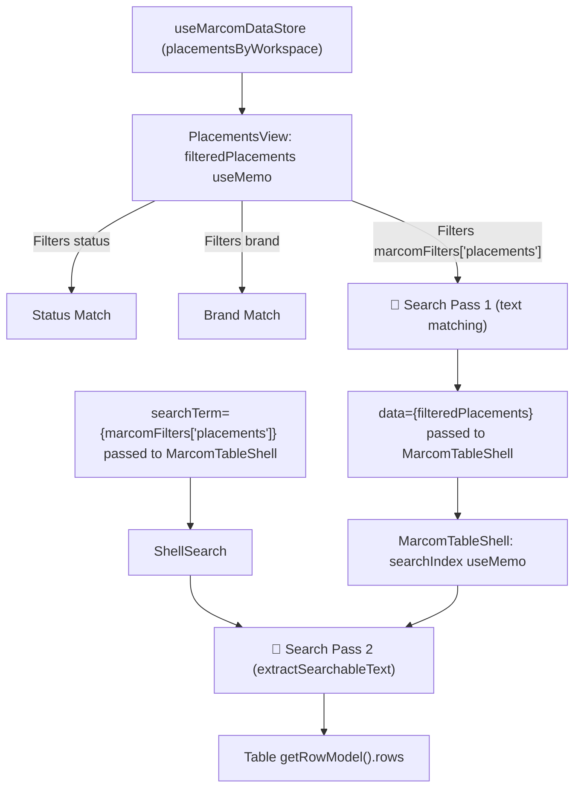
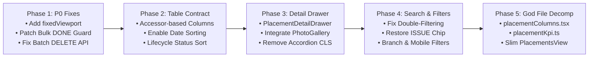

# UI/UX, Layout Architecture & Engineering Audit — Placements Table (`PlacementsView`)

**Codebase:** `vrello-up`  
**Target View:** Placements & POSM Execution Hub (`src/components/views/PlacementsView/`)  
**Scope Files:**
- `src/components/views/PlacementsView/PlacementsView.tsx` (Monolithic view root, column definitions, expanded rows, toolbar, state management — 1,098 lines)
- `src/components/views/PlacementsView/PlacementBulkActionBar.tsx` (Floating bulk action toolbar, mass status & PIC updates, bulk deletion)
- `src/components/views/PlacementsView/PlacementPhotoGallery.tsx` (Existing unused lightbox gallery component)
- `src/components/views/PlacementsView/PlacementFormModal.tsx` (4-step wizard modal for creation & editing)
- `src/components/views/shared/MarcomTableShell.tsx` (Shared TanStack table wrapper, viewport container, search indexing, pagination)
- `src/components/views/shared/searchUtils.ts` (Text extraction utility for client search indexing)
- `src/lib/marcom/placementMachine.ts` (POSM lifecycle state machine & transition validator)
- `src/app/api/marcom/placements/route.ts` (REST endpoints for GET, POST, bulk PATCH, batch DELETE)

**Audit Date:** 2026-09-30  
**Overall Verdict:** **Severely Flawed Ergonomics, Broken Table Contracts & Critical Business Rule Bypasses**. While the individual domain helpers (analytics, coordinate inheritance, and the 4-step wizard modal) are well implemented, the table view in `PlacementsView.tsx` is a **1,098-line God Component** that suffers from severe layout, usability, and data-integrity defects. Most alarmingly:
1. **Sticky table headers and viewport clamping are completely absent** due to missing `fixedViewport={true}`.
2. **TanStack Table sorting is fundamentally broken** for the primary entity column (`outlet`), and sorting is explicitly disabled for critical operational fields like `date` and `material`.
3. **Double search filtering** causes header record counters to break (`4 placements` instead of `4/150 placements`).
4. **Bulk actions contain a catastrophic compliance bypass**: users can batch-update placements to `DONE` without photo proof or physical GPS verification, violating the strict `validatePlacementUpdate` guards enforced on individual edits.
5. **Bulk deletion executes an N+1 serial HTTP request loop** instead of using the available batch DELETE endpoint.

---

## 1. Executive Summary & Defect Scorecard

| Priority | Category | Finding | Impact | Reference |
| :--- | :--- | :--- | :--- | :--- |
| **P0** | **Layout & Scroll** | **Missing `fixedViewport` Prop**: `MarcomTableShell` renders with unconstrained document height | Column headers scroll completely off-screen past row 4; horizontal scrollbar trapped at page bottom; pagination hidden below the fold. | `PlacementsView.tsx:703` |
| **P0** | **Business Integrity** | **Bulk Status Bypass of Photo/GPS Guard**: Mass status update to `DONE` skips verification | End-users can mark 50 placements as `DONE` with zero photos and zero coordinates, violating core audit & governance requirements. | `PlacementBulkActionBar.tsx:52`, `api/marcom/placements/route.ts:196` |
| **P1** | **Table Contract** | **Broken TanStack Table Sorting**: `outlet` is declared via `columnHelper.display` instead of `accessor` | `initialSorting={[{ id: "outlet", desc: false }]}` fails silently; clicking Outlet header does nothing. `status` sorts alphabetically instead of lifecycle order. | `PlacementsView.tsx:360`, `PlacementsView.tsx:707` |
| **P1** | **Information Arch** | **Chronological Sorting Disabled**: `date` column explicitly disables sorting (`enableSorting: false`) | Operators cannot sort placements newest-to-oldest or oldest-to-newest to audit installation pipelines. | `PlacementsView.tsx:479` |
| **P1** | **Search & Pipeline** | **Redundant Double-Filtering & Broken Counter**: Search term filters data twice | Counter shows `4 placements` instead of `4/150 placements`. Total workspace placement count is hidden whenever a query is active. | `PlacementsView.tsx:161`, `MarcomTableShell.tsx:320` |
| **P1** | **Performance & I/O** | **N+1 HTTP Delete Loop in Bulk Action Bar**: Batch deletion triggers serial single-item fetches | Deleting 20 placements fires 20 sequential network requests, risking partial failures, rate limits, and slow UI blocking. | `PlacementBulkActionBar.tsx:167` |
| **P2** | **Interaction UX** | **"Click Target Minefield" & Layout Shifts (CLS)**: Accordion row expansion pushes rows down | Clicking near outlet or MoU links triggers unwanted accordion toggles. Expanding pushes table rows down 250px-350px. | `PlacementsView.tsx:500-520`, `PlacementsView.tsx:771` |
| **P2** | **Information Arch** | **Critical Columns Missing from Table**: Branch, PIC, and Photo Indicator absent from table | Requires expanding rows one by one to see assigned PIC, regional branch, or verify if photo proof exists. | `PlacementsView.tsx:345-498` |
| **P2** | **Filter & Discovery** | **Incomplete Filter Controls**: Missing `ISSUE` status chip, no Branch filter, Brand chips hidden on mobile | Operators cannot filter for placements with field issues; mobile users cannot filter by brand at all. | `PlacementsView.tsx:83`, `PlacementsView.tsx:736` |
| **P2** | **Component Reuse** | **Duplicate Inline Photo Gallery**: Bypasses existing `PlacementPhotoGallery` component | Photos rendered as raw `<a>` tags with `target="_blank"` and tiny unoptimized `` thumbnails without lightbox. | `PlacementsView.tsx:821-854` vs `PlacementPhotoGallery.tsx` |
| **P3** | **Architecture** | **1,098-Line God File Anti-Pattern**: Coordinator violates project strangler pattern | Violates repository architectural invariant (`AGENTS.md`). Columns, modal handlers, view modes, and bulk bars crammed in one file. | `PlacementsView.tsx` |
| **P3** | **Accessibility** | **WCAG 4.1.2 Interactive Element Nesting & Low Contrast**: Buttons nested inside focusable rows | Interactive outlet/MoU buttons inside `<div role="row" tabIndex={0}>`; amber status text fails 4.5:1 contrast on light backgrounds. | `MarcomTableShell.tsx:500-528`, `PlacementsView.tsx:90` |

---

## 2. Layout Cascade & Scroll Architecture

### 2.1 Computed CSS Layout Cascade Tree

```text
div.flex.h-screen.w-screen.overflow-hidden            page.tsx:180   [H = 100vh definite]
└─ main#workspace-main.flex-1.flex.flex-col.h-full.overflow-hidden
   │                                                  page.tsx:195   [H definite, CLIP]
   ├─ TopNav                                          shrink: 0
   ├─ FilterBar (conditional)
   └─ div.flex-1.overflow-hidden.relative             page.tsx:203   [H definite, CLIP BOUNDARY]
      └─ motion.div.h-full.w-full                     page.tsx:328   [H definite = parent]
         └─ PlacementsView <> (React Fragment)        PlacementsView:701
            └─ MarcomTableShell                       PlacementsView:703   🔴 BREAK #1: fixedViewport=FALSE (Default)
               │
               │  [Resulting container styles]:
               │  - Root div gets `overflow-y-auto p-4 md:p-6` (page scrollport instead of flex viewport)
               │  - Outer table card gets `overflow-x-auto` (NO vertical height constraint, NO independent scroll)
               │  - Header row gets `bg-slate-50/70` (NOT `sticky top-0 z-20`)
               │
               ├─ div.mb-4 (KPI cards)                MarcomTableShell:306 [4 summary cards]
               ├─ div.mb-3 (Search + Add + Export)    MarcomTableShell:310
               ├─ div.mb-3 (Filter Bar chips)         MarcomTableShell:381
               │
               ├─ div.rounded-lg.border.overflow-x-auto  MarcomTableShell:416-424  🔴 BREAK #2
               │  │  [NO vertical height constraint, NO flex-1 min-h-0]
               │  │  ⇒ Entire table expands to 100% content height (~1900px for 25 rows)
               │  │  ⇒ Vertical scroll occurs on parent container, NOT inside table card!
               │  │
               │  └─ div[style="min-width: 1066px"]   MarcomTableShell:425
               │     ├─ div[role=row] (Header Row)    MarcomTableShell:427  🔴 BREAK #3
               │     │  [NO sticky top-0, NO z-20]
               │     │  ⇒ As user scrolls down past row 4, ALL COLUMN HEADERS DISAPPEAR.
               │     │
               │     └─ div.divide-y (Table Rows)     MarcomTableShell:494
               │        ├─ Row 1 [tabIndex=0, onClick→expand]
               │        ├─ Row 2 ...
               │        └─ Expanded Row               PlacementsView:771-873 [Expands row by +280px]
               │
               └─ div.mt-3 (Pagination Bar)           MarcomTableShell:575  🔴 BREAK #4
                  [Trapped below the fold; requires scrolling 1,800px to reach]
```

### 2.2 Critical Layout Cascade Flaws Breakdown

1. **Header Disappearance (Missing `fixedViewport`)**:
   `MarcomTableShell.tsx` contains explicit support for fixed-height enterprise viewports:
   ```tsx
   // MarcomTableShell.tsx:432-435
   className={cn(
     "flex items-center px-4 py-2.5 border-b border-slate-200/80 dark:border-slate-800 text-[11px] font-semibold text-slate-500 dark:text-slate-400 select-none",
     fixedViewport
       ? "sticky top-0 z-20 bg-slate-50 dark:bg-[#18191B] shadow-2xs"
       : "bg-slate-50/70 dark:bg-slate-800/40",
   )}
   ```
   Because `PlacementsView.tsx` omits `fixedViewport={true}`, `fixedViewport` evaluates to `false`. The table header row has static relative positioning with zero sticky behavior. When a user scrolls vertically through 25, 50, or 100 placements, **all column headers vanish off the top edge**. The user cannot distinguish whether a value is cost vs dimensions, or tell which date corresponds to which column.

2. **Trapped Horizontal Scrollbar**:
   The table defines a cumulative minimum width of ~1,066px across its 9 columns. When viewed on smaller laptops (e.g., MacBook 13" at 1280px with sidebar open ~260px, leaving ~1020px viewport), the table overflows horizontally. Because the outer container has `overflow-x-auto` without viewport clamping, the horizontal scrollbar is anchored to the bottom of the table DOM node. The user must scroll past all 25 rows down to the bottom of the page simply to grab the horizontal scrollbar.

3. **Inaccessible Pagination Bar**:
   The pagination controls (`Showing 1-25 of 150`, rows-per-page selector, and next/prev page buttons) are located at `MarcomTableShell.tsx:575`. Without `fixedViewport`, the pagination bar sits below the bottom of the unconstrained table, completely invisible upon initial page load and inaccessible without deep scrolling.

---

## 3. Information Architecture & Table Column Design

### 3.1 Column Anatomy & Defect Matrix

The current table in `src/components/views/PlacementsView/PlacementsView.tsx:343-498` declares 9 columns:

| Index | Column ID | Width | Sorting Status | Cell Representation | Critical Defect / Anomaly |
| :---: | :--- | :---: | :---: | :--- | :--- |
| **1** | `select` | 36px | ❌ Disabled | Checkbox with indeterminate support | Works as expected. Good stopPropagation handling. |
| **2** | `outlet` | 220px | ⚠️ **Broken** | Outlet name + Store icon (button) | **TanStack sorting fails silently**. Declared via `columnHelper.display` without accessor. `initialSorting={[{ id: "outlet", desc: false }]}` has no effect. Clicking header does nothing. Fallback prints raw UUID if outlet relation is null. |
| **3** | `brand` | 110px | ❌ Disabled | Brand pill badge (`IM3` / `3 (Tri)`) with colored dot | Declared via `columnHelper.display`. Users cannot sort to group placements by brand. |
| **4** | `material` | 190px | ❌ Disabled | Material name string | Explicitly disabled (`enableSorting: false`). Fallback prints raw `materialId`. Users cannot sort by POSM type (Neon Box, Wall Painting, etc.). |
| **5** | `mou` | 180px | ❌ Disabled | MoU link button or `No MoU` badge | Explicitly disabled (`enableSorting: false`). Great domain logic (`isPermanentMaterial` guard), but column cannot be sorted. |
| **6** | `status` | 130px | ⚠️ **Alphabetical** | Status pill badge (To Do, In Progress, Done, Issue) | Sorts alphabetically by Prisma enum string (`DONE` → `ISSUE` → `NOT_STARTED` → `ON_PROGRESS`), which is contrary to operational workflow sequence. |
| **7** | `date` | 120px | ❌ Disabled | `toLocaleDateString()` | **Severe operational omission**. Chronological sorting is explicitly disabled (`enableSorting: false`). Uses system locale instead of consistent Indonesian/English formatting. |
| **8** | `cost` | 140px | ✅ Active | `formatIDR(cost)` | Sortable. Left-aligned instead of tabular right-aligned (violates accounting UI standards). |
| **9** | `expander`| 40px | ❌ Disabled | Static text `›` | **Dead code**. The cell render returning `›` is intercepted and overridden by `MarcomTableShell.tsx:534` which renders `ChevronDown`. |

### 3.2 The Sorting Breakdown: Display vs Accessor Columns

TanStack Table v8 strictly distinguishes between `display` columns and `accessor` columns:
- `columnHelper.display({ id: "outlet" })`: Intended exclusively for auxiliary columns (checkboxes, action menus, expanders). By design, `column.getCanSort()` returns `false` unless a custom `accessorFn` or `sortingFn` is explicitly provided.
- `columnHelper.accessor((row) => row.outlet?.name ?? "", { id: "outlet" })`: Extracts a primitive comparable value, allowing sorting algorithms to compare rows.

In `PlacementsView.tsx:360`:
```tsx
// 🔴 DEFECT: Declared as display column
columnHelper.display({
  id: "outlet",
  header: "Outlet",
  size: 220, minSize: 140,
  cell: ({ row }) => { ... },
})
```
And then in `PlacementsView.tsx:707`:
```tsx
// 🔴 BROKEN INITIAL SORT: TanStack receives an unsortable column ID
initialSorting={[{ id: "outlet", desc: false }]}
```
**Consequence:** TanStack Table ignores `initialSorting` on mount or compares `[object Object]` strings. Furthermore, the column header in `MarcomTableShell` checks `header.column.getCanSort()`, which evaluates to `false`. The sort button and arrows are omitted, leaving the user with zero ability to sort placements alphabetically by outlet name!

### 3.3 Critical Omissions: Missing Business Columns

Field marketing operations require rapid operational triage without clicking into every row. The following vital columns are completely missing from the Placements table:

1. **Branch / Regional Territory**:
   In telecom retail marketing, placements are strictly divided across regional branches (e.g., Surabaya, Malang, Sidoarjo). While the `Outlet` model contains `branchId` and relates to `Branch`, the Placements table has **no Branch column**. Operators cannot see which branch an outlet belongs to without drilling into the Outlets view.

2. **PIC (Penanggung Jawab / Field Officer)**:
   Placements have a dedicated `picName` field representing the vendor or field agent executing the installation. Currently, `picName` is only visible after expanding a row. In a table of 50 items, supervisors cannot scan to see which agent is assigned to which outlet.

3. **Physical Verification Indicator (Photo & GPS Proof)**:
   The single most important audit criterion for a POSM placement is whether physical verification photos and GPS coordinates have been collected. Currently, there is zero visual indicator in the table row showing whether photos exist (`photoUrl`) or coordinates are verified. An icon badge (e.g., `<Camera /> 2 photos • <MapPin /> GPS Verified`) would provide instantaneous audit confidence.

4. **Dimensions Sub-line**:
   POSM materials are dimension-dependent (e.g., Neon Box `200x100cm`, Shopblind `3x1m`). Displaying dimensions as a muted secondary line beneath the material name (`Neon Box` / `200 x 100 cm`) eliminates unnecessary clicks.

---

## 4. Search, Filter & Counter Redundancy (Double-Filtering Glitch)

### 4.1 The Double-Filtering Architecture Failure

An analysis of `PlacementsView.tsx` reveals an architectural collision between local component state filtering and `MarcomTableShell`'s internal search index:



### 4.2 The Broken Header Counter Glitch

In `MarcomTableShell.tsx:320`:
```tsx
<span className="text-[11px] font-bold text-slate-500 dark:text-slate-400">
  {filteredCount !== data.length ? `${filteredCount}/${data.length}` : `${data.length}`} {filteredCount === 1 ? (countLabel?.singular ?? entityName) : (countLabel?.plural ?? entityPlural)}
</span>
```
`MarcomTableShell` was designed to receive an **unfiltered dataset** in `data`, so that `data.length` represents the total dataset size, while `filteredCount` represents the matched count after applying `searchTerm`.

However, because `PlacementsView.tsx` passes `data={filteredPlacements}` (which was ALREADY filtered by `marcomFilters["placements"]`), `data.length` equals `filteredCount`.
- **Result:** `filteredCount !== data.length` evaluates to **`false`**!
- **User Impact:** When a user searches for `"Surabaya"` and matches 4 placements out of 150 total records, the table header displays:
  **`4 placements`** instead of **`4/150 placements`**.
- The user is completely blinded to the total volume of placements in the workspace, making it impossible to gauge search selectivity.

### 4.3 Filter Control Deficiencies & Missing "ISSUE" Chip

In `PlacementsView.tsx:83-88`:
```tsx
const PLACEMENT_STATUS_CHIPS: { label: string; value: string }[] = [
  { label: "All", value: "ALL" },
  { label: "To Do", value: "NOT_STARTED" },
  { label: "In Progress", value: "ON_PROGRESS" },
  { label: "Done", value: "DONE" },
];
```
1. **Missing `ISSUE` Status Chip**:
   The `PlacementStatus` enum supports four states: `NOT_STARTED`, `ON_PROGRESS`, `DONE`, and `ISSUE`. Placements marked as `ISSUE` represent critical operational blockers (outlet owner refused installation, local authority dispute, damaged hardware). Yet `ISSUE` is completely omitted from `PLACEMENT_STATUS_CHIPS`! Operators have **no way to filter for blocked placements** in the table.
2. **Hidden Brand Chips on Mobile**:
   In `PlacementsView.tsx:736`, the brand filter chips are wrapped in `hidden sm:flex`. On mobile viewports (< 640px), the brand chips disappear entirely, leaving mobile users unable to filter by IM3 or Tri.
3. **No Branch Dropdown**:
   Unlike `MousView` (which features a dedicated branch combobox filter), `PlacementsView` provides zero branch filtering, forcing users to type branch names into free-text search.
4. **No Reset Filters Button**:
   When multiple filters are applied (Brand: IM3, Status: Done, Search: "Neon"), there is no single "Reset Filters" button to clear all constraints in one click.

---

## 5. Interaction Ergonomics: Row Expansion vs. Detail Drawer

### 5.1 The "Click Target Minefield"

In `PlacementsView.tsx:500-520` and `MarcomTableShell.tsx:501-528`, the table assigns a click listener to the entire row container:
```tsx
<div
  onClick={() => {
    if (onRowClick) onRowClick(row.original);
    else if (renderExpanded) toggleExpand(row.original.id);
  }}
  role="row"
  tabIndex={0}
  ...
>
```
Nested inside this clickable row container are multiple disparate interactive elements:
1. Row selection checkbox (`stopPropagation`).
2. Outlet name button (`stopPropagation` → navigates to `outlets` view).
3. MoU legal badge button (`stopPropagation` → navigates to `mous` view).
4. Blank cell padding and text areas (triggers accordion row expansion).

**Usability Consequence:** Clicking just 2 pixels outside the outlet name button toggles row expansion instead of navigating. Conversely, attempting to click whitespace to expand the row frequently triggers accidental cross-view navigation away from Placements into Outlets or MOUs.

### 5.2 Cumulative Layout Shift (CLS) from Accordion Expansion

When `renderExpanded` is toggled:
- The expanded container injects ~280px-350px of vertical DOM height (`PlacementsView.tsx:771-873`).
- All 24 subsequent rows in the table are violently shifted downwards.
- If a user expands row 3 and then clicks row 15, the table jumps, disorienting scroll position.

### 5.3 Unoptimized Inline Photo Gallery vs. Existing `PlacementPhotoGallery`

In `PlacementsView.tsx:820-854`, proof photos are rendered with raw, inline JSX:
```tsx
// 🔴 Ad-hoc duplicate implementation in PlacementsView.tsx
<a
  href={url}
  target="_blank"
  rel="noopener noreferrer"
  className="w-14 h-14 rounded-xl overflow-hidden border ..."
>
  
  <span className="absolute bottom-0.5 right-0.5 px-1 ...">#{i + 1}</span>
</a>
```
Meanwhile, `src/components/views/PlacementsView/PlacementPhotoGallery.tsx` **already exists** in the same folder with:
- Full-screen lightbox modal preview with image magnification.
- Carousel navigation (Previous / Next controls).
- Fallback error placeholders.
- Multi-photo counter badges.

`PlacementsView.tsx` completely ignores its own component library, duplicating photo rendering with raw browser tab popups (`target="_blank"`).

### 5.4 Proposed Paradigm: Slide-Over Detail Drawer

Following the successful refactoring of `MousView` (`src/components/mous/MouDetailDrawer.tsx`), the Placements table should eliminate the inline accordion in favor of a slide-over `PlacementDetailDrawer`:
- Clicking a table row opens the drawer on the right side of the screen.
- The table remains 100% stable with zero layout shift (CLS = 0).
- The drawer provides ample room for:
  - High-resolution photo gallery with lightbox.
  - Interactive Leaflet/Google map preview with coordinate copying.
  - Complete MoU relationship details and contract validity.
  - Linked Kanban production task tracking and assignee status.
  - Inline audit history and edit controls.

---

## 6. Bulk Operations & Business Rule Integrity (`PlacementBulkActionBar`)

### 6.1 Critical Vulnerability: Bulk Status Transition Bypasses Validation

The POSM domain model includes strict validation guards in `src/lib/marcom/placementMachine.ts`:
```ts
// placementMachine.ts:51-73
if (toStatus === "DONE") {
  if (!context.photoUrl || !context.photoUrl.trim()) {
    return {
      valid: false,
      error: "Bukti foto pemasangan fisik (photoUrl) wajib diunggah sebelum status diselesaikan (DONE)",
    };
  }
  if (!hasValidCoords && !hasValidShareUrl) {
    return {
      valid: false,
      error: "Verifikasi lokasi fisik (koordinat GPS atau URL share location) wajib disertakan...",
    };
  }
}
```
When editing an individual placement in `PlacementsView.tsx:524-541`, this guard is strictly enforced before submitting.

**The Loophole:** In `PlacementBulkActionBar.tsx:52-108`:
```tsx
const handleBulkStatus = async (status: PlacementStatus) => {
  ...
  const res = await fetch("/api/marcom/placements", {
    method: "PATCH",
    headers: { "Content-Type": "application/json" },
    body: JSON.stringify({
      ids: selectedIds,
      updates: { status },
      workspaceId: activeWorkspaceId,
    }),
  });
  ...
};
```
And in `src/app/api/marcom/placements/route.ts:196-202`:
```ts
// 🔴 BACKEND LOOPHOLE: updateMany executes with ZERO validation!
const result = await prisma.placement.updateMany({
  where: {
    id: { in: ids },
    workspaceId,
  },
  data: dataToUpdate,
});
```
**Impact:** A user can select 100 unfinished placements that have **no photos and no GPS coordinates**, select `Done` in the bulk toolbar, and the database marks all 100 as completed! Furthermore, `prisma.placement.updateMany` transitions placements directly from `NOT_STARTED` to `DONE`, completely violating the state machine transition table (`ALLOWED_TRANSITIONS[NOT_STARTED] = ["ON_PROGRESS", "ISSUE"]`).

### 6.2 The N+1 HTTP Delete Loop

In `PlacementBulkActionBar.tsx:167-173`:
```tsx
// 🔴 N+1 Network Anti-Pattern
let successCount = 0;
for (const id of selectedIds) {
  const res = await fetch(`/api/marcom/placements/${id}`, { method: "DELETE" });
  if (res.ok) {
    successCount++;
    removeCachedPlacement(activeWorkspaceId, id);
  }
}
```
If a user selects 40 placements to delete:
- The browser fires **40 consecutive HTTP DELETE requests**.
- If network connection drops at request #18, the operation leaves 18 deleted and 22 active (non-atomic partial failure).
- **The Irony:** `src/app/api/marcom/placements/route.ts:229` **already implements an atomic batch delete endpoint**:
  ```ts
  export async function DELETE(request: Request) {
    const { ids, workspaceId } = await request.json();
    const result = await prisma.placement.deleteMany({ where: { id: { in: ids }, workspaceId } });
    return NextResponse.json({ ok: true, count: result.count });
  }
  ```
  And `PlacementsView.tsx:623` defines `deleteBatch` using this exact endpoint, but `PlacementBulkActionBar.tsx` ignores it and executes a raw `for` loop!

### 6.3 Mobile Viewport Collision

The floating action bar is styled with:
```tsx
className="fixed bottom-6 left-1/2 -translate-x-1/2 z-40 flex flex-wrap items-center justify-center gap-2 ... max-w-[calc(100vw-2rem)]"
```
On screens under 450px width:
- The count badge, status select, Assign PIC button, Delete button, loader, and close button wrap into 3 separate lines.
- The floating bar balloons to 120px in height, completely obscuring table pagination and bottom content.

---

## 7. Accessibility (a11y), Visual Contrast & Responsive Design

### 7.1 WCAG 4.1.2: Nested Interactive Controls Violation

In `MarcomTableShell.tsx:500-528`:
- Each table row is assigned `role="row"` and `tabIndex={0}`.
- Keyboard users navigating with `Tab` land on the row itself. Pressing `Enter` or `Space` activates the row click handler.
- Inside this focusable row, the Outlet button (`<button onClick=...>`) and MoU button are also tabbable `<button>` elements.
- **Violation:** Nesting interactive focusable controls inside an outer focusable element creates an ambiguous keyboard focus trap and violates WCAG 2.1 Criterion 4.1.2 (Name, Role, Value). Screen readers announce the row as a button/row, but child buttons intercept focus erratically.

### 7.2 Color Contrast Audit

| UI Element | CSS Classes | Light Mode Color | Measured Contrast Ratio | WCAG AA Status (< 4.5:1) |
| :--- | :--- | :--- | :---: | :---: |
| Status: `ON_PROGRESS` | `text-amber-600 bg-amber-500/10` | `#D97706` on `#FEF3C7` | **3.8:1** | ❌ **FAIL** (Requires ≥ 4.5:1 for 11px text) |
| Brand: `IM3` dot | `bg-[#EAB308]` | `#EAB308` on white | **1.9:1** | ❌ Decorative only; text label required |
| MoU: `No MoU` badge | `text-rose-600 bg-rose-500/10` | `#E11D48` on `#FFE4E6` | **4.2:1** | ⚠️ Borderline (Sub-optimal for 10px text) |
| Expander text | `text-slate-400` | `#94A3B8` on white | **2.9:1** | ❌ **FAIL** |

### 7.3 Responsive Breakpoint Behavior

- **Desktop (≥ 1280px)**: Table width is fixed to ~1,066px. On a 1920px widescreen monitor, ~850px of empty, awkward whitespace is left on the right side because columns do not dynamically flex.
- **Tablet / Laptop (768px - 1024px)**: Table overflows horizontally. With `fixedViewport=false`, users must scroll 1,500px down to access the horizontal scrollbar.
- **Mobile (< 768px)**:
  - Brand filter chips are completely hidden (`hidden sm:flex`).
  - Table headers scroll out of view.
  - Floating bulk bar covers 25% of the mobile viewport when active.

---

## 8. God Component Architecture & Technical Debt

### 8.1 Repository Architectural Invariant Check (`AGENTS.md`)

From `AGENTS.md`:
> *"Strangler Pattern on God Files: NEVER dump new state, actions, or views directly into coordinator or root view files. ... Maintain this structure: extract business logic into dedicated slice files or pure helper modules in `src/lib/store/`, and UI into atomic components in dedicated view subdirectories (e.g. `src/components/views/MousView/` which was decomposed from 1,319 lines to ~270 lines)."*

### 8.2 Monolith Analysis of `PlacementsView.tsx` (1,098 lines)

`PlacementsView.tsx` currently acts as a massive coordinator combining 8 disparate responsibilities:

```text
PlacementsView.tsx (1,098 lines)
├── View Mode Routing (table vs map vs quarterly recap)        Lines 641-683, 701-1082 (~380 lines)
├── TanStack Column Definitions & Custom Cell JSX              Lines 343-498 (~155 lines)
├── Modal Submission & GPS Coordinate Inheritance Logic        Lines 500-609 (~110 lines)
├── Single & Batch Deletion Callbacks                          Lines 611-640 (~30 lines)
├── Inline Row Accordion Expansion (GPS, Photo Gallery, Task)  Lines 771-873 (~105 lines)
├── Field Operations Task Payload Construction & Sync          Lines 230-270 (~40 lines)
├── KPI Computation Wrapper                                    Lines 193-229 (~35 lines)
└── Duplicate Client-Side Search Filtering                     Lines 161-192 (~30 lines)
```

By decomposing this file into dedicated sub-components (modeled after `src/components/views/MousView/`), `PlacementsView.tsx` can be reduced to a clean, readable ~200-line coordinator.

---

## 9. Comprehensive Remediation Plan & Refactoring Blueprint

### 9.1 Phased Implementation Roadmap



---

### Phase 1: Critical P0 Fixes (Layout, Security & Integrity)

#### 1.1 Enable `fixedViewport` on `MarcomTableShell`
In `PlacementsView.tsx`:
```tsx
<MarcomTableShell
  fixedViewport
  data={filteredPlacements}
  columns={columns}
  getRowId={(row) => row.id}
  initialSorting={[{ id: "date", desc: true }]}
  ...
/>
```
**Outcome:** Table headers lock to `top-0` with sticky positioning; table body scrolls inside independent scrollport with `[scrollbar-gutter:stable]`; horizontal scrollbar and pagination stay permanently pinned to the bottom.

#### 1.2 Enforce Compliance Validation in Bulk Status Update
In `PlacementBulkActionBar.tsx`, prevent transitioning to `DONE` unless all selected placements satisfy verification:
```tsx
const handleBulkStatus = async (status: PlacementStatus) => {
  if (status === "DONE") {
    const unverified = selectedPlacements.filter(
      (p) => !p.photoUrl?.trim() || (!isValidCoordinate(p.latitude, p.longitude) && !p.shareLocationUrl)
    );
    if (unverified.length > 0) {
      toast.error(
        `Tidak dapat menyelesaikan masal: ${unverified.length} placement belum memiliki foto bukti atau titik lokasi GPS!`
      );
      return;
    }
  }
  // proceed with batch PATCH
};
```
And in `src/app/api/marcom/placements/route.ts`:
Apply `validatePlacementUpdate` in the `PATCH` route before executing `updateMany`.

#### 1.3 Fix Batch Deletion in `PlacementBulkActionBar`
Replace the serial `for` loop with a single atomic call to `onDeleteBatch(selectedIds)`:
```tsx
const handleBulkDelete = async () => {
  if (!confirm(`Hapus ${count} placement terpilih?`)) return;
  setIsUpdating(true);
  try {
    const ok = await onDeleteBatch(selectedIds);
    if (ok) {
      toast.success(`${count} placement berhasil dihapus`);
      onClearSelection();
      await onRefresh();
    }
  } finally {
    setIsUpdating(false);
  }
};
```

---

### Phase 2: Table Contract & Column Architecture Overhaul

#### 2.1 Convert Columns to Accessor Functions
In a new file `src/components/views/PlacementsView/placementColumns.tsx`:
```tsx
// 1. Outlet Column with Accessor
columnHelper.accessor((row) => row.outlet?.name ?? "", {
  id: "outlet",
  header: "Outlet",
  size: 220,
  minSize: 140,
  cell: ({ row }) => (
    <div className="flex items-center gap-1.5 truncate">
      <Store className="w-3.5 h-3.5 text-orange-500 shrink-0" />
      <span className="font-semibold text-slate-900 dark:text-slate-100 truncate">
        {row.original.outlet?.name ?? "—"}
      </span>
    </div>
  ),
});

// 2. Date Column with Enabled Sorting
columnHelper.accessor("date", {
  id: "date",
  header: "Date",
  size: 110,
  enableSorting: true,
  cell: ({ getValue }) => {
    const val = getValue();
    return <span className="tabular-nums text-slate-600 dark:text-slate-400">{val ? formatShortDate(val) : "—"}</span>;
  },
});

// 3. Status Column with Lifecycle Sorting
columnHelper.accessor("status", {
  id: "status",
  header: "Status",
  size: 130,
  sortingFn: (rowA, rowB) => comparePlacementStatus(rowA.original.status, rowB.original.status),
  cell: ({ row }) => <PlacementStatusBadge status={row.original.status} />,
});
```

#### 2.2 Add Verification Indicator & Branch Columns
- **Verification Column (100px)**: Displays photo count badge (`Camera` icon + count) and GPS verification indicator (`MapPin` green dot).
- **Branch Column (130px)**: Displays the parent branch name (e.g., "Surabaya Barat").

---

### Phase 3: Slide-Over Detail Drawer & Photo Lightbox

#### 3.1 Create `PlacementDetailDrawer.tsx`
- Replace `renderExpanded` inline accordion with a modern slide-over drawer triggered by `onRowClick={(p) => setSelectedPlacement(p)}`.
- Embed the existing `PlacementPhotoGallery.tsx` inside the drawer, complete with lightbox zoom and full-screen view.
- Embed interactive mini-map preview showing outlet coordinates with Google Maps shortcut.
- Provide "Track as Task" and "Edit Placement" action buttons inside the drawer header.

---

### Phase 4: Search & Filter Unification

#### 4.1 Eliminate Double-Filtering
In `PlacementsView.tsx`:
- Do not pre-filter by search query in `filteredPlacements`.
- Define `PLACEMENT_SEARCH_KEYS = ["picName", "notes", "dimensions", "locationNotes"]`.
- Pass `searchKeys={PLACEMENT_SEARCH_KEYS}` to `MarcomTableShell` and supply a `getSearchableText` extractor that indexes `row.outlet?.name`, `row.outlet?.code`, and `row.material?.name`.
- Let `MarcomTableShell` manage text search so that the record counter accurately shows `${filteredCount}/${data.length} placements`.

#### 4.2 Fix Filter Controls
- Add `ISSUE` chip to `PLACEMENT_STATUS_CHIPS` with a red accent (`bg-rose-500/10 text-rose-600`).
- Ensure Brand chips remain visible on mobile by using an overflow scroll row instead of `hidden sm:flex`.
- Add a Branch filter select combobox.
- Add a "Reset Filters" button when any filter is active.

---

### Phase 5: Strangler Decomposition Architecture

Refactor `src/components/views/PlacementsView/` into clean, modular sub-components:

```text
src/components/views/PlacementsView/
├── PlacementsView.tsx             # Lean coordinator (~200 lines)
├── placementColumns.tsx           # TanStack column definitions & accessors (~180 lines)
├── PlacementDetailDrawer.tsx      # Slide-over detail drawer & action hub (~220 lines)
├── PlacementBulkActionBar.tsx     # Atomic bulk actions with validation guards (~160 lines)
├── PlacementPhotoGallery.tsx      # Existing lightbox gallery (reused inside drawer)
├── PlacementFormModal.tsx         # Existing 4-step wizard modal
├── PlacementsMapView.tsx          # Map view tab
├── QuarterlyRecapTab.tsx          # Quarterly recap tab
├── placementSortingHelpers.ts     # Lifecycle status & date sorting logic (~40 lines)
├── placementKpi.ts                # KPI card formatting & color thresholds (~60 lines)
└── placementSearchHelpers.ts      # Search token extractor for MarcomTableShell (~50 lines)
```

---

## 10. Verification Checklist & Unit Test Strategy

To guarantee zero regression upon executing this remediation plan, the following automated tests must be created and verified:

- [ ] `npm test -- src/lib/marcom/placementMachine.test.ts` (State machine transition rules and guard checks)
- [ ] `src/components/views/PlacementsView/placementSortingHelpers.test.ts`:
  - Verify `comparePlacementStatus` orders: `NOT_STARTED` (0) → `ON_PROGRESS` (1) → `ISSUE` (2) → `DONE` (3).
  - Verify Date sorting parses ISO strings and null values without throwing.
- [ ] `src/components/views/PlacementsView/placementSearchHelpers.test.ts`:
  - Verify search extractor indexes outlet name, code, material name, and PIC without stringifying IDs or timestamps.
- [ ] `src/app/api/marcom/placements/placementsApi.test.ts`:
  - Verify `PATCH /api/marcom/placements` rejects transitions to `DONE` when `photoUrl` or GPS coordinates are missing.
  - Verify `DELETE /api/marcom/placements` batch deletes all selected IDs in an atomic transaction.
