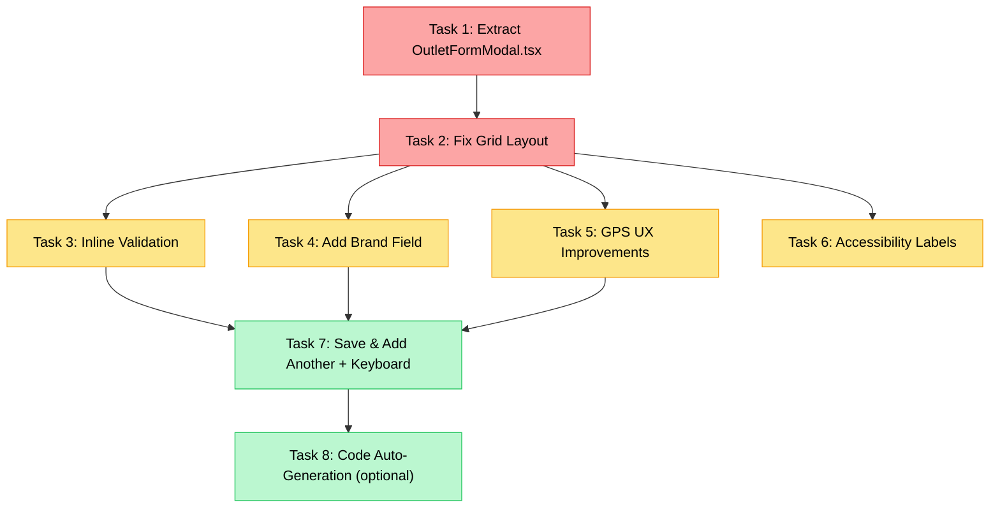

# Outlet Form Modal — UI/UX Evaluation & Improvement Plan

> **Date:** 2026-09-29
> **Scope:** Admin "Add New Outlet" / "Edit Outlet" modal in [OutletsView.tsx](file:///Users/mac/Web%20Development/vrello-up/src/components/views/OutletsView/OutletsView.tsx#L799-L1026)
> **Reference:** [SubmitDraftOutletModal.tsx](file:///Users/mac/Web%20Development/vrello-up/src/components/views/OutletsView/SubmitDraftOutletModal.tsx) (field staff version — already well-extracted)

---

## Current State Screenshot


---

## 1. Problem Summary

The admin "Add New Outlet" modal suffers from **layout bugs, missing domain fields, poor form ergonomics, zero inline validation, and architectural bloat** (230 lines of inline JSX inside a 1,041-line God View). The field staff version (`SubmitDraftOutletModal`) was properly extracted with dedicated helpers, but the admin modal was never given the same treatment.

---

## 2. Detailed Findings

### 2.1 Structural Layout Bug — Broken Nested Grid

**Severity:** 🔴 High (visible in screenshot)

The form body uses a parent `grid grid-cols-2 gap-3` (line 849) with 6 direct children. But children #2 and #4 are themselves nested `grid grid-cols-2`, creating a **4-way column split** for Type, City, PIC Name, and PIC Phone — each field gets only 1/4 of the modal width.

**Visible symptoms:**
- PIC Phone placeholder is truncated (`08123456` visible instead of `08123456789`)
- Type and City select/input are uncomfortably narrow
- Tier select sits alone on a full half-width row — wasted space
- Address textarea and GPS card have mismatched heights on the same row

**Root cause:** The second `<div>` inside the parent grid (starting at line 849) contains Outlet Name + a nested Type/City grid + another nested Tier + another nested PIC grid + Address + GPS card — all as siblings inside a single grid cell. The visual result is an unpredictable, cramped waterfall.

### 2.2 Missing Domain Field — `Brand` (IM3 / TRI)

**Severity:** 🟡 Medium

The [Prisma Outlet model](file:///Users/mac/Web%20Development/vrello-up/prisma/schema.prisma#L130) includes `brand Brand @default(IM3)` with enum values `IM3` and `TRI`. The modal has no field for this attribute. Every outlet silently gets `IM3` regardless of actual brand affiliation. For accurate brand-level reporting and analytics, this field should be exposed.

### 2.3 No Inline Validation — Generic Toast on Submit Failure

**Severity:** 🟡 Medium

When required fields are missing, the form relies on:
1. Native HTML `required` attributes (inconsistently applied — Tier has none)
2. A fallback JavaScript guard at line 396: `toast.error("Code, name, type, tier, and branch are required")`

There is no per-field error highlighting, no red borders, no helper text. Compare with `SubmitDraftOutletModal` which already implements proper `errors` state, conditional `border-rose-500`, and inline `<p>` error messages.

### 2.4 GPS "Detect Current GPS" — Misleading for Remote Entry

**Severity:** 🟡 Medium (data quality risk)

The "Detect Current GPS" button calls `navigator.geolocation.getCurrentPosition()` and silently records the **current user's device coordinates**. If an admin in the HQ office in Semarang registers an outlet in Solo or Kudus, the GPS data will be the HQ office — not the outlet.

- The button label says "Detect Current GPS" without clarifying it captures the user's present device location
- No warning or confirmation that this should only be used when physically at the outlet site
- No ability to paste a Google Maps coordinate string (e.g., `-6.9932, 110.4203`) which is how field staff typically share coordinates
- No "View on Maps" verification link after coordinates are entered

### 2.5 Missing "Save & Add Another" Flow

**Severity:** 🟢 Low (workflow friction)

When batch-registering outlets from field survey data or spreadsheets, the user must:
1. Fill all fields → click "Create Outlet" → modal closes
2. Click "Add Outlet" again → modal opens with empty form
3. Re-select the same Branch (since it resets to `branches[0]`)

A "Save & Add Another" action that keeps the modal open and preserves the Branch selection would cut registration time in half.

### 2.6 No `htmlFor` / `id` Linking on Labels

**Severity:** 🟢 Low (accessibility)

None of the `<label>` elements have `htmlFor` attributes and none of the inputs have `id` attributes. Clicking a label does not focus the corresponding input. This violates WCAG 1.3.1 (Info and Relationships) and degrades usability for assistive technology users and desktop power users.

### 2.7 Inconsistent Required Field Indicators

**Severity:** 🟢 Low (visual inconsistency)

- `Outlet Code *` — asterisk as plain text inside label
- `Outlet Name *` — same
- `Type` — asterisk wrapped in `<span className="text-red-500">*</span>` (different styling)
- `Parent Branch *` — plain text asterisk
- `Tier` — no asterisk at all, but it IS validated as required in the JS guard

### 2.8 No Keyboard Shortcut for Submit

**Severity:** 🟢 Low

Form submit only works via mouse click on the "Create Outlet" button. `Cmd+Enter` / `Ctrl+Enter` is not wired up.

### 2.9 Outlet Code — No Auto-Generation or Duplicate Prevention

**Severity:** 🟢 Low (data integrity risk)

The `code` column is `@unique` in Prisma. But the form provides no assistance:
- No auto-generation suggestion (e.g., `OUT-{BRANCH_CODE}-{SEQUENCE}`)
- No real-time uniqueness check before submit
- Duplicate code only surfaces as a server-side 500/409 error after the user has already filled out the entire form

### 2.10 Architectural: 230-Line Inline Modal in 1,041-Line God View

**Severity:** 🟡 Medium (maintainability)

The entire modal (lines 799–1026) lives inline inside `OutletsView.tsx`, including form state management (`handleSaveOutlet`, `handleGetLocationInModal`, `isLocatingInModal`, `isSaving`, `modalOutlet`). This mirrors the exact anti-pattern that was already fixed for the draft modal — `SubmitDraftOutletModal.tsx` (460 lines) was extracted with its own helpers file (`submitDraftOutletHelpers.ts`, 85 lines).

---

## 3. Proposed Layout Structure

```
┌─────────────────────────────────────────────────────────────────┐
│ 🏪 Add New Outlet                                            ✕ │
├─────────────────────────────────────────────────────────────────┤
│                                                                 │
│ SECTION 1: OUTLET IDENTITY                                      │
│ ┌─────────────────────────────┐ ┌─────────────────────────────┐ │
│ │ Parent Branch *        [▼]  │ │ Outlet Code * [🔄 Auto]     │ │
│ └─────────────────────────────┘ └─────────────────────────────┘ │
│ ┌───────────────────────────────────────────────────────────────┐│
│ │ Outlet Name *                                                ││
│ └───────────────────────────────────────────────────────────────┘│
│                                                                 │
│ SECTION 2: CLASSIFICATION & CONTACT                             │
│ ┌───────────────┐ ┌───────────────┐ ┌───────────┐              │
│ │ Type *   [▼]  │ │ Tier *   [▼]  │ │ Brand [▼] │              │
│ └───────────────┘ └───────────────┘ └───────────┘              │
│ ┌─────────────────────────────┐ ┌─────────────────────────────┐ │
│ │ 👤 PIC Name                 │ │ 📞 PIC Phone (tel)          │ │
│ └─────────────────────────────┘ └─────────────────────────────┘ │
│                                                                 │
│ SECTION 3: LOCATION & GPS                                       │
│ ┌─────────────────────────────┐ ┌─────────────────────────────┐ │
│ │ City / Regency              │ │ Quick Paste "lat, lng"      │ │
│ └─────────────────────────────┘ └─────────────────────────────┘ │
│ ┌───────────────────────────────────────────────────────────────┐│
│ │ Full Physical Address (textarea)                             ││
│ └───────────────────────────────────────────────────────────────┘│
│ ┌───────────────────────────────────────────────────────────────┐│
│ │ 📍 GPS Coordinates                                           ││
│ │ Lat: [-6.9932]    Lng: [110.4203]                            ││
│ │ [📍 Use Device Location]  [↗ Verify on Maps]                 ││
│ │ ⚠ "Only use when physically at the outlet location"          ││
│ └───────────────────────────────────────────────────────────────┘│
│                                                                 │
├─────────────────────────────────────────────────────────────────┤
│ [Cancel]                  [Save & Add Another]  [Create Outlet] │
└─────────────────────────────────────────────────────────────────┘
```

---

## 4. Implementation Tasks

### Task 1: Extract Modal into `OutletFormModal.tsx`

**Priority:** 🔴 Must — architectural prerequisite for all other tasks

**What:**
- Extract lines 799–1026 from [OutletsView.tsx](file:///Users/mac/Web%20Development/vrello-up/src/components/views/OutletsView/OutletsView.tsx) into a new `src/components/views/OutletsView/OutletFormModal.tsx` component
- Extract `handleSaveOutlet` (lines 392–444) and `handleGetLocationInModal` (lines 370–390) into a new `src/components/views/OutletsView/outletFormHelpers.ts` helper module
- Move state variables (`modalOutlet`, `isSaving`, `isLocatingInModal`) into the new component's internal state
- The parent `OutletsView` only passes: `isOpen`, `onClose`, `initialOutlet`, `branches`, `onSuccess` callback

**Acceptance criteria:**
- `OutletsView.tsx` drops by ~230 lines
- Modal opens/closes identically to current behavior
- Edit mode (passing existing outlet) and Create mode both work
- All existing functionality preserved — no regressions

**Files touched:**
| File | Action |
|------|--------|
| `src/components/views/OutletsView/OutletFormModal.tsx` | **Create** |
| `src/components/views/OutletsView/outletFormHelpers.ts` | **Create** |
| `src/components/views/OutletsView/OutletsView.tsx` | **Modify** — remove inline modal, import new component |

---

### Task 2: Fix Grid Layout — Proper Section-Based Form Structure

**Priority:** 🔴 Must — directly addresses the visual bugs in the screenshot

**What:**
- Replace the broken nested `grid grid-cols-2` with 3 labeled sections:
  1. **Outlet Identity** — Parent Branch + Outlet Code (2-col), Outlet Name (full width)
  2. **Classification & Contact** — Type + Tier + Brand (3-col), PIC Name + PIC Phone (2-col)
  3. **Location & GPS** — City + Quick Paste (2-col), Address (full width), GPS card (full width)
- Use section headers: subtle `text-[10px] font-bold uppercase tracking-wider text-slate-400` labels with a `border-b` divider
- Ensure every field has adequate width — no field should get less than 50% of modal width
- Add consistent spacing using the project's existing `space-y-4` / `gap-3` rhythm

**Acceptance criteria:**
- PIC Phone placeholder fully visible without truncation
- Tier, Type, and City fields have comfortable widths
- All fields visually scannable without cramping
- GPS card height does not misalign with its row neighbors

**Files touched:**
| File | Action |
|------|--------|
| `src/components/views/OutletsView/OutletFormModal.tsx` | **Modify** |

---

### Task 3: Add Inline Validation with Per-Field Error States

**Priority:** 🟡 Should

**What:**
- Add an `errors: Record<string, string>` state to the modal component
- On submit, validate all required fields and set per-field errors before calling the API
- Required fields: `code`, `name`, `type`, `tier`, `branchId`
- Show `border-rose-500` on invalid inputs and a `<p className="text-[11px] text-rose-500">` message below each
- Clear individual field errors on change (same pattern as `SubmitDraftOutletModal`)
- Keep the toast as a fallback for unexpected server errors only

**Reusable pattern:** Mirror the `validateDraftForm` approach from [submitDraftOutletHelpers.ts](file:///Users/mac/Web%20Development/vrello-up/src/components/views/OutletsView/submitDraftOutletHelpers.ts#L23-L51), adapted for admin form fields (no `photoUrl` required, `code` required).

**Acceptance criteria:**
- Submitting an empty form highlights all 5 required fields individually
- Typing into a red field clears its error immediately
- No more generic "Code, name, type, tier, and branch are required" toast for client-side validation

**Files touched:**
| File | Action |
|------|--------|
| `src/components/views/OutletsView/outletFormHelpers.ts` | **Modify** — add `validateOutletForm()` |
| `src/components/views/OutletsView/OutletFormModal.tsx` | **Modify** — wire error states |
| `src/components/views/OutletsView/outletFormHelpers.test.ts` | **Create** — unit test validation logic |

---

### Task 4: Add `Brand` Field (IM3 / TRI Selector)

**Priority:** 🟡 Should

**What:**
- Add a `brand` field to the form, positioned alongside Type and Tier in the Classification section
- Render as a segmented pill toggle or a simple `<select>` with two options: `IM3` and `TRI`
- Default to `IM3` (matching Prisma default)
- Include `brand` in the save payload sent to `/api/marcom/outlets`
- Verify the API endpoint accepts and persists the `brand` field

**Acceptance criteria:**
- New outlets can be explicitly tagged as IM3 or TRI
- Existing outlets without explicit brand retain `IM3` default
- The field is visible in both Create and Edit modes

**Files touched:**
| File | Action |
|------|--------|
| `src/components/views/OutletsView/OutletFormModal.tsx` | **Modify** — add Brand selector |
| `src/components/views/OutletsView/outletFormHelpers.ts` | **Modify** — include brand in payload builder |
| `src/app/api/marcom/outlets/route.ts` | **Verify** — ensure POST/PATCH accept `brand` |

---

### Task 5: GPS Coordinates UX Improvements

**Priority:** 🟡 Should

**What — 3 sub-improvements:**

**5a. Clarify "Detect Current GPS" label and add field warning**
- Rename button to "Use Device Location"
- Add a helper text below the GPS card: *"⚠ Only accurate when physically at the outlet location"*
- Keep existing `navigator.geolocation` logic unchanged

**5b. Quick-paste coordinate support**
- Add a single text input above or beside the Lat/Lng fields: `Quick paste: "-6.9932, 110.4203"`
- On paste/change, parse the string, split by comma, and auto-populate Latitude and Longitude
- Clear the quick-paste input after successful parse

**5c. "View on Google Maps" verification link**
- When both `latitude` and `longitude` are populated, render a small link: `View on Maps ↗`
- Opens `https://www.google.com/maps?q=${lat},${lng}` in a new tab
- Hidden when coordinates are empty

**Acceptance criteria:**
- Pasting `-6.9932, 110.4203` into the quick-paste field populates both Lat and Lng
- "View on Maps" link opens correct pin location in a new tab
- Warning text visible below GPS card at all times

**Files touched:**
| File | Action |
|------|--------|
| `src/components/views/OutletsView/OutletFormModal.tsx` | **Modify** |
| `src/components/views/OutletsView/outletFormHelpers.ts` | **Modify** — add `parseCoordinateString()` |
| `src/components/views/OutletsView/outletFormHelpers.test.ts` | **Modify** — test coordinate parsing edge cases |

---

### Task 6: Accessibility — Label/Input Linking & Required Indicators

**Priority:** 🟡 Should

**What:**
- Add `id` attributes to all form inputs (e.g., `id="outlet-code"`, `id="outlet-name"`)
- Add `htmlFor` attributes to all `<label>` elements matching the input IDs
- Standardize required field indicators: use `<span className="text-rose-500 ml-0.5">*</span>` consistently on all required labels (Code, Name, Type, Tier, Branch)
- Remove the asterisk from non-required fields

**Acceptance criteria:**
- Clicking any label focuses the corresponding input
- All required fields have identical red asterisk styling
- Non-required fields have no asterisk

**Files touched:**
| File | Action |
|------|--------|
| `src/components/views/OutletsView/OutletFormModal.tsx` | **Modify** |

---

### Task 7: "Save & Add Another" Button + Keyboard Submit

**Priority:** 🟢 Nice-to-have

**What:**
- Add a secondary "Save & Add Another" button in the footer between Cancel and Create
- On success: reset form to empty state but preserve the `branchId` selection
- Add `onKeyDown` handler on the form: `Cmd+Enter` / `Ctrl+Enter` triggers submit
- Replace text-swap loading (`"Saving..."` / `"Create Outlet"`) with an inline `<Loader2 className="animate-spin" />` icon next to the text to prevent button width jump

**Acceptance criteria:**
- "Save & Add Another" creates the outlet, clears the form, keeps modal open with same Branch selected
- `Cmd+Enter` submits the form from any input field
- Button width does not change between normal and loading states

**Files touched:**
| File | Action |
|------|--------|
| `src/components/views/OutletsView/OutletFormModal.tsx` | **Modify** |

---

### Task 8: Outlet Code Auto-Generation Hint (Optional)

**Priority:** 🟢 Nice-to-have

**What:**
- When a Branch is selected and the Code field is empty, show a dimmed suggestion below the input: `Suggested: OUT-{BRANCH_CODE}-{NEXT_SEQ}`
- Clicking the suggestion (or a small "Auto" button) fills the Code field
- The sequence number can be derived from a count query or a simple client-side counter
- This is a progressive enhancement — the user can always type a manual code

**Acceptance criteria:**
- Selecting a Branch generates a code suggestion
- Clicking the suggestion populates the Code field
- Manual entry always takes precedence — the suggestion disappears when the user types

**Files touched:**
| File | Action |
|------|--------|
| `src/components/views/OutletsView/OutletFormModal.tsx` | **Modify** |
| `src/app/api/marcom/outlets/route.ts` | **Modify** — optional: add `GET /api/marcom/outlets/next-code?branchId=X` |

---

## 5. Recommended Execution Order



> **Task 1 is the hard prerequisite.** All subsequent tasks modify the extracted `OutletFormModal.tsx`, not the monolithic `OutletsView.tsx`. Tasks 2–6 are independent and can be parallelized. Tasks 7–8 depend on the layout being settled.

---

## 6. Out of Scope

| Item | Reason |
|------|--------|
| Rewriting `SubmitDraftOutletModal` | Already well-structured with proper helpers and validation |
| Adding image/photo upload to admin modal | Admin creates approved outlets — photo is only required in the draft submission flow |
| Refactoring `OutletsView.tsx` table/map/filter logic | Separate concern; this plan only addresses the modal form |
| Real-time duplicate code checking via API | Can be added later as a progressive enhancement on top of Task 8 |
