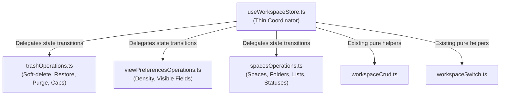

# God-Files Strangler Phase 1: Sub-Slice Extraction for `useWorkspaceStore.ts`

- **Date**: 2026-09-19
- **Status**: Draft / Under Review
- **Author**: Antigravity & Pair Programming Partner
- **Scope**: Sub-Proyek 1 dari Inisiatif Refactoring God-Files (Fokus: `useWorkspaceStore.ts`)

---

## 1. Context & Motivation

### Background
[`src/lib/store/useWorkspaceStore.ts`](file:///Users/mac/Web%20Development/vrello-up/src/lib/store/useWorkspaceStore.ts) telah berkembang menjadi monolit sebesar **2.633 baris**, melanggar aturan arsitektur pada [`AGENTS.md`](file:///Users/mac/Web%20Development/vrello-up/AGENTS.md) (*"Strangler Pattern on God Files"*).

Meskipun ukurannya besar, kode di dalam store ini sangat modular secara logika dan telah memiliki unit test yang sangat solid di `src/lib/store/`:
- `trash.test.ts`
- `spaces.test.ts`
- `viewPreferences.test.ts`
- `workspaceCrud.test.ts` (sudah diekstrak ke `workspaceCrud.ts`)
- `workspaceSwitch.test.ts` (sudah diekstrak ke `workspaceSwitch.ts`)

### Goals
1. Memangkas baris kode `useWorkspaceStore.ts` secara substansial (~600–800 baris kode berkurang) tanpa mengubah API publik bagi ratusan komponen consumer.
2. Mengekstrak domain murni yang tidak memiliki dependensi visual/JSX:
   - **Trash Operations** (`trashOperations.ts`)
   - **View Preferences Operations** (`viewPreferencesOperations.ts`)
   - **Space, Folder, List, & Status Operations** (`spacesOperations.ts`)
3. Menjamin **Zero Visual Risk** dan **Zero Regression** (semua 264 unit test lolos dan `npm run typecheck` bersih).

---

## 2. Architectural Design

### Pattern: Pure Domain Reducer / Operations Modules
Mengikuti pola teruji dari [`workspaceCrud.ts`](file:///Users/mac/Web%20Development/vrello-up/src/lib/store/workspaceCrud.ts):
- Setiap modul berisi fungsi murni (*pure functions*) yang menerima bagian state saat ini dan parameter operasi, lalu mengembalikan state baru yang tidak termutasi (*immutable state transition*).
- `useWorkspaceStore.ts` hanya memanggil fungsi-fungsi ini di dalam handler `set((state) => ...)` dan mengurus side-effect persistensi/sinkronisasi API (`syncWorkspaces`, `syncDeleteTask`, dll).



---

## 3. Module Specifications

### Module A: `src/lib/store/trashOperations.ts`
Bertanggung jawab atas siklus hidup tempat sampah (Trash):
- **Constants**:
  - `TRASH_LIMIT = 50`
  - `TRASH_RETENTION_MS = 30 * 24 * 60 * 60 * 1000` (30 hari)
- **Functions**:
  1. `applyDeleteTaskWithTrash(state, taskId, nowIso)`:
     - Memfilter task dari `state.tasks`.
     - Membersihkan dependensi task yang dihapus dari task lain.
     - Memasukkan snapshot task ke `state.trash` (dibatasi `TRASH_LIMIT`).
     - Mereset `selectedTaskId`, `lastSelectedTaskId`, dan `selectedTaskIds`.
  2. `applyRestoreTasksFromTrash(state, taskIds, nowIso)`:
     - Mengembalikan task dari `state.trash` ke `state.tasks` dengan `updatedAt = nowIso`.
     - Menghapus task dari `state.trash`.
     - Mengembalikan `{ nextState, revivedCount, revivedEntries }`.
  3. `applyPermanentlyDeleteTask(state, taskId)`:
     - Menghapus entri spesifik dari `state.trash`.
  4. `applyEmptyTrash()`:
     - Mengosongkan `state.trash`.
  5. `applyPurgeExpiredTrash(state, nowMs)`:
     - Menghapus entri trash yang lebih lama dari `TRASH_RETENTION_MS`.

### Module B: `src/lib/store/viewPreferencesOperations.ts`
Bertanggung jawab atas preferensi tampilan Kanban/List:
- **Constants**:
  - `DEFAULT_VIEW_PREFERENCES`
- **Functions**:
  1. `applyViewPreferences(state, updates)`:
     - Melakukan deep merge antara `state.viewPreferences` dengan `updates` (khususnya density dan partial `visibleFields`).
  2. `resetViewPreferences()`:
     - Mengembalikan ke `DEFAULT_VIEW_PREFERENCES`.

### Module C: `src/lib/store/spacesOperations.ts`
Bertanggung jawab atas hirarki ruang kerja, folder, list, dan status workflow:
- **Functions**:
  1. `applyCreateSpace(state, { name, icon, color, activeWorkspaceId })`:
     - Membuat objek `Space` lengkap dengan status default, list "General", dan ID unik.
     - Menambahkan space ke workspace aktif dan mengaktifkan space tersebut.
  2. `applyUpdateSpace(state, spaceId, updates)`:
     - Memperbarui metadata space (nama, icon, warna).
  3. `applyDeleteSpace(state, spaceId)`:
     - Menghapus space dari workspace aktif.
     - Menghapus semua task yang berada di dalam list space/folder tersebut (*cascading cleanup*).
     - Membersihkan dependensi task yang terhapus dan mereset activeSpaceId/activeListId ke space berikutnya.
  4. `applyReorderSpaces(state, orderedSpaceIds)` & `applyMoveSpace(state, spaceId, direction)`:
     - Mengatur ulang urutan array space.
  5. `applyFolderOperations`:
     - `applyCreateFolder(state, spaceId, name, icon)`
     - `applyUpdateFolder(state, folderId, updates)`
     - `applyDeleteFolder(state, folderId)` (dengan cascading task cleanup).
  6. `applyListOperations`:
     - `applyCreateList(state, spaceId, folderId, name, icon)`
     - `applyUpdateList(state, listId, updates)`
     - `applyDeleteList(state, listId)` (dengan cascading task cleanup).
  7. `applySpaceStatusOperations`:
     - `applyAddStatusToSpace(state, spaceId, name, color, category)`
     - `applyUpdateSpaceStatus(state, spaceId, statusId, updates)`
     - `applyDeleteSpaceStatus(state, spaceId, statusId)`
     - `applyReorderSpaceStatuses(state, spaceId, orderedStatusIds)`

---

## 4. Verification Plan

### Automated Tests
1. **Unit Test Spesifik Domain**:
   ```bash
   npm test -- src/lib/store/trash.test.ts
   npm test -- src/lib/store/viewPreferences.test.ts
   npm test -- src/lib/store/spaces.test.ts
   ```
2. **Full Test Suite**:
   ```bash
   npm test
   ```
   Harus tetap 264/264 test lolos tanpa regresi.
3. **TypeScript Strict Typecheck**:
   ```bash
   npm run typecheck
   ```
   Harus 0 errors (`tsc --noEmit` lolos bersih).

---

## 5. Non-Goals (Out of Scope for Phase 1)
- Memodifikasi UI komponen visual (`PlacementsView.tsx`, `ContentPlannerView.tsx`, `EventFormModal.tsx`). Ini dilakukan pada Fase 2 & 3 setelah E2E harness terpasang.
- Mengubah skema database Prisma atau REST API routes.

