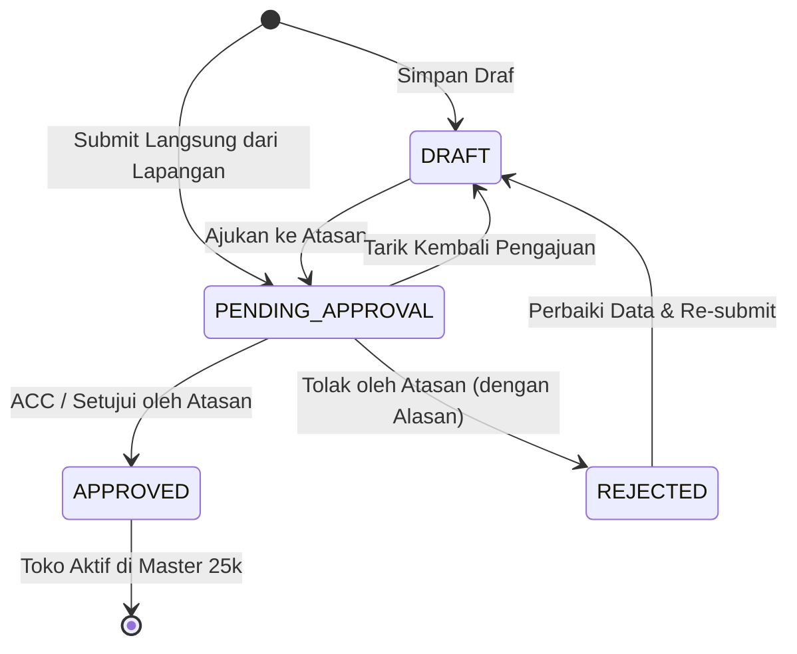

# Spesifikasi Desain: Alur Pengajuan Toko Baru (Draft Outlet & Approval/ACC Atasan)

**Tanggal:** 2026-09-21  
**Status:** Draf Terverifikasi (Siap Review)  
**Dokumen Referensi:** Transkrip Diskusi Teknis Regional Jateng (P1 & P2), `vrello-up` Architecture  

---

## 1. Latar Belakang & Tujuan Bisnis

Berdasarkan kesepakatan antara PIC Bisnis Regional Jateng (P1) dan Tech Lead (P2):
1. **Integritas Master Data 25.000 Toko:**  
   Jawa Tengah memiliki sekitar 25.000 outlet terdaftar. Tenaga sales di lapangan (~800 orang) **tidak diizinkan** menambahkan data langsung ke master data aktif untuk mencegah duplikasi data (misal: "Berkah Cell" vs "Toko Berkah Celular"), kesalahan ketik, titik GPS palsu/tanpa koordinat, atau hilangnya standarisasi kode toko (`code`).
2. **Kebutuhan Lapangan (Sales Rep):**  
   Saat melakukan pemasangan materi promosi (POSM), sales sering menemukan kios/outlet baru yang belum terdaftar di sistem. Sales membutuhkan alur cepat dan ramah mobile untuk mengajukan toko baru langsung dari lapangan:
   - Nama Toko & Tipe Outlet (Traditional / Modern Retail / Exclusive / Campus).
   - Cabang (*Branch*) & Alamat/Kota.
   - PIC & Kontak Toko.
   - Titik Koordinat GPS aktual (via sensor perangkat / Leaflet).
   - Bukti foto fasad/tampak depan kios.
3. **Pemisahan Peran & Tata Kelola (Approval / ACC Atasan):**  
   - Toko yang diajukan berstatus `PENDING_APPROVAL` dengan `active = false`.
   - PIC Bisnis / Admin Regional / Branch Manager memiliki antarmuka khusus untuk meninjau toko yang diajukan.
   - Peninjau dapat memvalidasi foto toko, koordinat GPS pada peta OpenStreetMap, dan mengecek duplikasi nama.
   - **Tindakan ACC / Approve:** Toko disetujui, kode resmi ditetapkan/dikonfirmasi (e.g. `O-SMG-xxx`), status menjadi `APPROVED`, `active = true`, dan toko langsung aktif di master data.
   - **Tindakan Reject:** Toko ditolak dengan alasan yang tercatat (e.g. "Toko duplikat dengan O-SMG-012", "Foto tidak jelas"), status menjadi `REJECTED`, dan sales dapat merevisi atau menarik draft tersebut.

---

## 2. Ruang Lingkup (Scope)

### Dalam Cakupan (Fase 2B)
1. **Model Data & Skema Prisma:**
   - Penambahan atribut `status` (`DRAFT`, `PENDING_APPROVAL`, `APPROVED`, `REJECTED`), `photoUrl`, `submittedBy`, `rejectionReason`, `approvedBy`, `approvedAt` pada model `Outlet`.
   - Default `status: APPROVED` dan `active: true` untuk seluruh data eksisting agar 100% *backward-compatible*.
2. **State Machine Murni & Validasi Transisi:**
   - Modul `src/lib/marcom/outletApprovalMachine.ts` dengan penegakan transisi status yang valid.
3. **Tata Kelola Perizinan (Guards):**
   - Penambahan permission action `SUBMIT_DRAFT_OUTLET` (staff, admin) dan `APPROVE_OUTLET` (admin global atau staff dengan penugasan cabang resmi sesuai *Four-Eyes Principle*).
4. **Backend API Endpoints:**
   - `POST /api/marcom/outlets/draft`: Pengajuan toko baru oleh sales lapangan.
   - `PATCH /api/marcom/outlets/[id]/approval`: Endpoint aksi ACC / Reject oleh Atasan / Admin.
   - Dukungan filter status pada `GET /api/marcom/outlets?status=...`.
5. **Antarmuka Pengguna (UI & Components):**
   - Komponen `SubmitDraftOutletModal.tsx`: Form mobile-friendly dengan deteksi GPS dan upload/input foto fasad kios.
   - Integrasi tombol pintasan pada `OutletSearchCombobox.tsx`: *"Toko belum terdaftar? Ajukan Toko Baru"*.
   - Tab **"Antrean Approval (N)"** pada `OutletsView.tsx`: Daftar toko menunggu ACC lengkap dengan pratinjau foto, titik peta, dialog ACC, dan dialog penolakan.
6. **Pengujian Komprehensif:**
   - Unit test untuk state machine, permission guards, helper generator kode, dan komponen UI.

---

## 3. Desain Arsitektur & Model Data

### 3.1 Perubahan Skema Prisma (`prisma/schema.prisma`)
Pada model `Outlet`:
```prisma
enum OutletStatus {
  DRAFT
  PENDING_APPROVAL
  APPROVED
  REJECTED
}

model Outlet {
  id              String        @id @default(cuid())
  code            String        @unique
  name            String
  type            OutletType
  tier            OutletTier
  address         String        @default("")
  city            String        @default("")
  picName         String        @default("")
  picPhone        String        @default("")
  active          Boolean       @default(true)
  brand           String        @default("")
  latitude        Float?
  longitude       Float?
  branchId        String
  branch          Branch        @relation(fields: [branchId], references: [id], onDelete: Cascade)
  placements      Placement[]
  mous            Mou[]
  events          FieldEvent[]
  posts           ContentPost[]

  // --- FIELD SIKLUS HIDUP PENGURUSAN TOKO (FASE 2B) ---
  status          OutletStatus  @default(APPROVED)
  photoUrl        String        @default("")
  submittedBy     String        @default("")
  rejectionReason String        @default("")
  approvedBy      String        @default("")
  approvedAt      DateTime?

  @@index([status])
  @@index([branchId])
}
```

### 3.2 Pembaruan Tipe Domain (`src/types/index.ts`)
```typescript
export type OutletStatus = "DRAFT" | "PENDING_APPROVAL" | "APPROVED" | "REJECTED";

export interface OutletItem {
  id: string;
  code: string;
  name: string;
  type: OutletType;
  tier?: OutletTier;
  brand?: string;
  address: string;
  city: string;
  picName: string;
  picPhone: string;
  active: boolean;
  branchId: string;
  branch?: { id: string; code: string; name: string };
  placementCount?: number;
  mouCount?: number;
  latitude?: number | null;
  longitude?: number | null;

  // Lifecycle fields
  status?: OutletStatus;
  photoUrl?: string;
  submittedBy?: string;
  rejectionReason?: string;
  approvedBy?: string;
  approvedAt?: string | null;
}
```

---

## 4. State Machine & Alur Transisi

File: `src/lib/marcom/outletApprovalMachine.ts`



### Matriks Transisi
| Status Saat Ini | Transisi yang Diizinkan | Keterangan |
|---|---|---|
| `DRAFT` | `PENDING_APPROVAL` | Sales mengajukan draft toko ke antrean review. |
| `PENDING_APPROVAL` | `APPROVED`, `REJECTED`, `DRAFT` | Atasan ACC atau Reject; Sales dapat menarik draf jika salah input. |
| `REJECTED` | `DRAFT`, `PENDING_APPROVAL` | Sales memperbaiki catatan revisi dan mengajukan ulang. |
| `APPROVED` | (Terminal) | Toko resmi terdaftar di master data aktif (`active = true`). |

---

## 5. Tata Kelola Hak Akses (Permissions & Four-Eyes Principle)

File: `src/lib/marcom/guards.ts`

- **Aksi `SUBMIT_DRAFT_OUTLET`**:
  - `staff` (sales lapangan) dan `admin`.
- **Aksi `APPROVE_OUTLET`**:
  - `admin`: memiliki kewenangan menyetujui seluruh cabang di regional Jawa Tengah.
  - `staff`: hanya dapat menyetujui jika ditugaskan resmi sebagai Branch PIC (`userBranchIds.includes(targetBranchId)`). Pengaju tidak dapat menyetujui pengajuannya sendiri tanpa otorisasi cabang yang sah.

---

## 6. Format Kode Otomatis (*Auto-Generated Code*)

File: `src/lib/marcom/outletCodeGenerator.ts`

- **Format Saat Draft:** `DRAFT-[BRANCH_CODE]-[TIMESTAMP_LAST_4]` (contoh: `DRAFT-SMG-4819`).
- **Format Saat ACC / Approved:**  
  Jika admin tidak menentukan kode khusus manual, sistem menyarankan kode resmi: `O-[BRANCH_CODE]-[URUTAN]` (contoh: `O-SMG-0842`).

---

## 7. Desain Antarmuka Pengguna (UI)

1. **Pintasan Lapangan di `OutletSearchCombobox.tsx`**:
   - Jika query pencarian tidak menghasilkan toko (atau opsi tambahan di dasar daftar dropdown):
   - Tombol: `+ Toko tidak ditemukan? Ajukan Toko Baru`.
   - Mengambil lokasi GPS terkini dari `navigator.geolocation` jika diizinkan browser.
2. **Form Pengajuan `SubmitDraftOutletModal.tsx`**:
   - Input Nama Toko, Tipe Toko, Cabang, Alamat, Kota, PIC & Nomor Telepon.
   - Input Foto Fasad Toko (Upload / Pratinjau Gambar).
   - Pratinjau Titik Koordinat GPS pada peta mini Leaflet ($0 Maps API).
3. **Tab Antrean Review di `OutletsView.tsx`**:
   - Tab switcher: `[ 🏢 Master Outlet (25.000+) ]` | `[ ⏳ Antrean Approval (N) ]`.
   - Menampilkan kartu/tabel pengajuan dengan:
     - Foto fasad toko (klik untuk memperbesar).
     - Pin koordinat GPS dan jarak deviasi.
     - Nama sales pengaju (`submittedBy`).
     - Tombol hijau: **"ACC / Setujui"** (membuka modal konfirmasi penetapan kode outlet resmi).
     - Tombol merah: **"Tolak"** (membuka modal input catatan/alasan penolakan).
