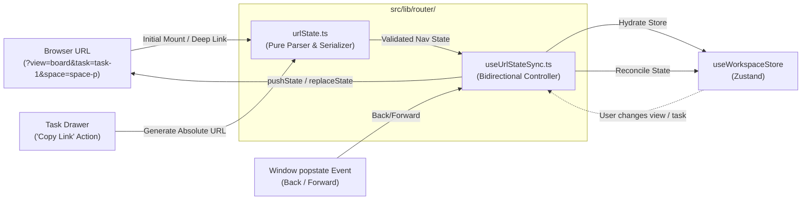

# Architecture Specification: URL Routing & Deep-Linking State Synchronization

- **Date**: 2026-09-21
- **Status**: Draft / Under Review
- **Author**: Antigravity (Senior Software Engineer) & Pair Programming Partner
- **Scope**: Resolving the "SPA Trapped Inside Next.js" Anti-Pattern (Deep-linking, Browser History, & URL State Sync)

---

## 1. Context & Motivation

### Background
[`src/app/page.tsx`](file:///Users/mac/Web%20Development/vrello-up/src/app/page.tsx) currently runs as a single-route client monolith (`"use client"`). All navigational state (`activeView`, `activeSpaceId`, `activeListId`, `selectedTaskId`, `appMode`) is stored in-memory in Zustand:
- **Zero Deep-Linking**: Users cannot share direct URLs to specific tasks, boards, or spaces.
- **Broken Browser Navigation**: Pressing the browser's **Back** or **Forward** button navigates away from the site rather than stepping back through opened task drawers, spaces, or views.
- **Next.js Overhead Without Benefits**: The application pays the overhead of Next.js 15 App Router while behaving as an isolated SPA without URL-driven state.

### Goals & Non-Goals
* **Goals**:
  1. Full **Deep-Linking**: Direct URL access to any view (`?view=board`), space (`?space=space-id`), list (`?list=list-id`), and task drawer (`?task=task-id`).
  2. Full **Browser History Support**: Browser **Back** and **Forward** buttons close modal drawers, switch back to previous views, or step between spaces seamlessly.
  3. **Zero-Dependency & YAGNI**: Implement via native Web Platform History APIs (`pushState`, `replaceState`, `popstate`) and `URLSearchParams` without bulky external router state libraries.
  4. **Strangler Pattern Discipline**: Zero lines of bloated state logic added to [`useWorkspaceStore.ts`](file:///Users/mac/Web%20Development/vrello-up/src/lib/store/useWorkspaceStore.ts). All parsing and serialization isolated in `src/lib/router/`.
  5. **Shareable Task Links**: One-click "Copy Link" inside the Task Drawer generating universal shareable URLs.
* **Non-Goals**:
  - Restructuring the 17 views into separate Next.js filesystem folders (rejected via Approach 2 due to high risk of layout churn and offline dual-persistence complications).

---

## 2. Architectural Design



### Pure Serialization & Validation Contract (`src/lib/router/urlState.ts`)
```ts
export interface UrlNavState {
  appMode?: "tasks" | "marcom";
  view?: ViewMode;
  workspaceId?: string;
  spaceId?: string;
  listId?: string;
  taskId?: string;
}

export function parseUrlNavState(searchOrParams: string | URLSearchParams): UrlNavState;
export function serializeUrlNavState(state: UrlNavState): string;
export function buildShareableTaskUrl(taskId: string, currentSearch?: string): string;
```

#### Invariant Protections
1. **Whitelist Validation**: `view` is strictly validated against the known `ViewMode` enum (`"home" | "list" | "board" | "table" | ...`). Any malicious or unknown string is dropped, preventing UI crashes.
2. **Loop Prevention**: Before dispatching `history.pushState`, `useUrlStateSync` compares serialized target search params against the current `window.location.search`. If they match, the update is a no-op, preventing infinite pushState loops.
3. **Push vs. Replace Semantics**:
   - `history.pushState`: Triggered on user-intentional view switches and task drawer opens/closes (creating a navigable history step).
   - `history.replaceState`: Triggered on initial hydration or background filter adjustments.

---

## 3. Detailed Component & Integration Plan

### 1. `src/lib/router/urlState.ts`
- Pure, zero-dependency helper functions.
- Fully unit-tested under Node test runner without browser environment dependencies.

### 2. `src/lib/router/useUrlStateSync.ts`
- Hook mounted in [`src/app/page.tsx`](file:///Users/mac/Web%20Development/vrello-up/src/app/page.tsx).
- On mount:
  - Reads `window.location.search`.
  - If URL params exist, overrides in-memory store state immediately so the linked view and task display without flicker.
  - Registers `popstate` listener for browser history traversal.
- On store mutations:
  - Updates URL search query whenever `activeView`, `selectedTaskId`, `activeSpaceId`, `activeListId`, or `appMode` changes.

### 3. Share Action in `TaskDrawer.tsx`
- Provide a "Copy link to task" action inside the task header dropdown/toolbar.
- Generates `https://.../?task=<id>&view=<currentView>`.
- Displays a toast confirmation (`toast.success("Task link copied to clipboard")`).

---

## 4. Verification Plan

### Automated Unit Tests
- New test file: `src/lib/router/urlState.test.ts`
  - Validates query string parsing to `UrlNavState`.
  - Validates rejection of unknown/invalid view modes.
  - Validates URL generation with multiple concurrent params (`view`, `task`, `space`, `list`).
  - Validates `buildShareableTaskUrl` output with and without existing parameters.
- Regression verification:
  - Run full test suite: `npm test` (all 311+ tests passing).
  - Verify clean TypeScript types: `npm run typecheck`.

### Manual End-to-End Verification
1. **Deep Linking**:
   - Open browser with `/?view=board&task=task-1`.
   - Verify that Board View is displayed and Task Drawer for `task-1` is open immediately on load.
2. **Browser History**:
   - Close the Task Drawer via `ESC` or close button -> verify URL updates to `/?view=board`.
   - Press browser **Back** button -> verify Task Drawer re-opens and URL returns to `/?view=board&task=task-1`.
   - Press browser **Forward** button -> verify Task Drawer closes again.
3. **Task Link Copy**:
   - Click "Copy Link" in Task Drawer -> paste into new tab -> verify same task opens immediately.
